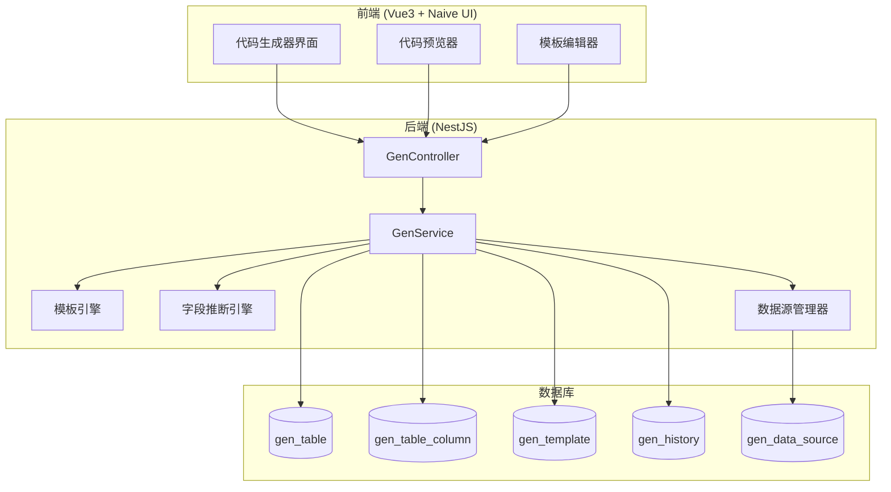

# Design Document: Enterprise Code Generator

## Overview

本设计文档描述了企业级代码生成器的技术架构和实现方案。该系统基于现有的代码生成器基础进行扩展，支持多数据源、多租户、智能字段推断、模板管理、代码预览与版本管理等企业级功能。

生成的代码将与现有项目无缝集成，遵循项目编码规范，并自动生成完整的 Swagger/OpenAPI 文档。

## Architecture

### 系统架构图



### 模块架构

```
server/src/module/system/tool/
├── gen.module.ts                 # 模块定义
├── gen.controller.ts             # API 控制器
├── gen.service.ts                # 核心业务逻辑
├── datasource/
│   ├── datasource.service.ts     # 数据源管理
│   └── datasource.dto.ts         # 数据源 DTO
├── template/
│   ├── template.service.ts       # 模板管理
│   ├── template.dto.ts           # 模板 DTO
│   └── engines/
│       ├── nestjs/               # NestJS 模板
│       └── vue/                  # Vue3 模板
├── inference/
│   └── field-inference.service.ts # 字段推断引擎
├── history/
│   └── history.service.ts        # 历史版本管理
├── dto/
│   ├── gen-table.dto.ts          # 表配置 DTO
│   ├── gen-column.dto.ts         # 列配置 DTO
│   └── responses/                # 响应 DTO
└── utils/
    ├── naming.util.ts            # 命名转换工具
    └── code-formatter.util.ts    # 代码格式化工具
```

## Components and Interfaces

### 1. 数据源管理器 (DataSourceManager)

```typescript
interface IDataSource {
  id: number;
  name: string;
  type: 'postgresql' | 'mysql' | 'sqlite';
  host: string;
  port: number;
  database: string;
  username: string;
  password: string; // 加密存储
  tenantId: string;
  status: '0' | '1';
}

interface IDataSourceService {
  // 创建数据源
  create(dto: CreateDataSourceDto): Promise<Result<IDataSource>>;
  
  // 测试连接
  testConnection(dto: TestConnectionDto): Promise<Result<boolean>>;
  
  // 获取数据源列表
  findAll(query: QueryDataSourceDto): Promise<Result<IPaginatedData<IDataSource>>>;
  
  // 获取数据源的表列表
  getTables(dataSourceId: number): Promise<Result<IDbTable[]>>;
  
  // 获取表的列信息
  getColumns(dataSourceId: number, tableName: string): Promise<Result<IDbColumn[]>>;
}
```

### 2. 字段推断引擎 (FieldInferenceEngine)

```typescript
interface IFieldInferenceRule {
  pattern: RegExp;
  apply: (column: IDbColumn) => Partial<IGenTableColumn>;
}

interface IFieldInferenceService {
  // 推断单个字段
  inferColumn(column: IDbColumn): IGenTableColumn;
  
  // 批量推断字段
  inferColumns(columns: IDbColumn[]): IGenTableColumn[];
  
  // 注册自定义规则
  registerRule(rule: IFieldInferenceRule): void;
}

// 默认推断规则
const DEFAULT_INFERENCE_RULES: IFieldInferenceRule[] = [
  { pattern: /status/i, apply: () => ({ htmlType: 'radio', dictType: 'sys_normal_disable' }) },
  { pattern: /type|sex/i, apply: () => ({ htmlType: 'select' }) },
  { pattern: /time|date/i, apply: () => ({ htmlType: 'datetime', javaType: 'Date' }) },
  { pattern: /image|avatar/i, apply: () => ({ htmlType: 'imageUpload' }) },
  { pattern: /file/i, apply: () => ({ htmlType: 'fileUpload' }) },
  { pattern: /content|remark/i, apply: () => ({ htmlType: 'editor' }) },
  { pattern: /name/i, apply: () => ({ queryType: 'LIKE' }) },
];
```

### 3. 模板引擎 (TemplateEngine)

```typescript
interface ITemplateContext {
  table: IGenTable;
  columns: IGenTableColumn[];
  primaryKey: IGenTableColumn | null;
  className: string;
  businessName: string;
  moduleName: string;
  functionName: string;
  author: string;
  datetime: string;
  tenantAware: boolean;
}

interface ITemplateService {
  // 渲染模板
  render(templateContent: string, context: ITemplateContext): string;
  
  // 获取模板组
  getTemplateGroup(groupId: number): Promise<ITemplateGroup>;
  
  // 创建模板组
  createTemplateGroup(dto: CreateTemplateGroupDto): Promise<Result<ITemplateGroup>>;
  
  // 验证模板语法
  validateTemplate(content: string): Result<boolean>;
  
  // 导出模板组
  exportTemplateGroup(groupId: number): Promise<string>;
  
  // 导入模板组
  importTemplateGroup(json: string, tenantId: string): Promise<Result<ITemplateGroup>>;
}

interface ITemplateGroup {
  id: number;
  name: string;
  description: string;
  tenantId: string | null; // null 表示系统级模板
  templates: ITemplate[];
}

interface ITemplate {
  id: number;
  groupId: number;
  name: string;
  fileName: string; // 输出文件名模板
  filePath: string; // 输出路径模板
  content: string;
  language: 'typescript' | 'vue' | 'sql';
}
```

### 4. 代码生成服务 (GenService)

```typescript
interface IGenService {
  // 导入表
  importTables(dto: ImportTablesDto, user: UserDto): Promise<Result<void>>;
  
  // 同步表结构
  syncTable(tableName: string): Promise<Result<void>>;
  
  // 预览代码
  preview(tableId: number): Promise<Result<IPreviewResult>>;
  
  // 生成代码
  generate(dto: GenerateCodeDto): Promise<Result<Buffer>>;
  
  // 批量生成
  batchGenerate(dto: BatchGenerateDto): Promise<Result<Buffer>>;
  
  // 获取生成历史
  getHistory(tableId: number): Promise<Result<IGenHistory[]>>;
  
  // 比较版本
  compareVersions(historyId1: number, historyId2: number): Promise<Result<IDiffResult>>;
}

interface IPreviewResult {
  files: IPreviewFile[];
}

interface IPreviewFile {
  name: string;
  path: string;
  content: string;
  language: string;
  size: number;
  lineCount: number;
}
```

### 5. 历史版本管理 (HistoryService)

```typescript
interface IGenHistory {
  id: number;
  tableId: number;
  tableName: string;
  templateGroupId: number;
  generatedBy: string;
  generatedAt: Date;
  snapshot: string; // JSON 存储生成的代码快照
}

interface IHistoryService {
  // 记录生成历史
  record(tableId: number, snapshot: IPreviewResult, user: UserDto): Promise<void>;
  
  // 获取历史列表
  getHistory(tableId: number, limit?: number): Promise<IGenHistory[]>;
  
  // 获取历史详情
  getHistoryDetail(historyId: number): Promise<IPreviewResult>;
  
  // 清理过期历史
  cleanupOldHistory(days: number): Promise<number>;
}
```

## Data Models

### 数据库模型扩展

```prisma
// 数据源配置表
model GenDataSource {
  id          Int       @id @default(autoincrement())
  tenantId    String    @map("tenant_id") @db.VarChar(20)
  name        String    @db.VarChar(100)
  type        String    @db.VarChar(20) // postgresql, mysql, sqlite
  host        String    @db.VarChar(255)
  port        Int
  database    String    @db.VarChar(100)
  username    String    @db.VarChar(100)
  password    String    @db.VarChar(500) // 加密存储
  status      String    @default("0") @db.Char(1)
  delFlag     String    @default("0") @map("del_flag") @db.Char(1)
  createBy    String    @default("") @map("create_by") @db.VarChar(64)
  createTime  DateTime? @map("create_time") @default(dbgenerated("CURRENT_TIMESTAMP"))
  updateBy    String    @default("") @map("update_by") @db.VarChar(64)
  updateTime  DateTime? @map("update_time") @default(dbgenerated("CURRENT_TIMESTAMP"))
  remark      String?   @db.VarChar(500)

  @@unique([tenantId, name])
  @@index([tenantId, status])
  @@map("gen_data_source")
}

// 模板组表
model GenTemplateGroup {
  id          Int       @id @default(autoincrement())
  tenantId    String?   @map("tenant_id") @db.VarChar(20) // null 表示系统级
  name        String    @db.VarChar(100)
  description String?   @db.VarChar(500)
  isDefault   Boolean   @default(false) @map("is_default")
  status      String    @default("0") @db.Char(1)
  delFlag     String    @default("0") @map("del_flag") @db.Char(1)
  createBy    String    @default("") @map("create_by") @db.VarChar(64)
  createTime  DateTime? @map("create_time") @default(dbgenerated("CURRENT_TIMESTAMP"))
  updateBy    String    @default("") @map("update_by") @db.VarChar(64)
  updateTime  DateTime? @map("update_time") @default(dbgenerated("CURRENT_TIMESTAMP"))

  templates   GenTemplate[]

  @@unique([tenantId, name])
  @@map("gen_template_group")
}

// 模板表
model GenTemplate {
  id          Int       @id @default(autoincrement())
  groupId     Int       @map("group_id")
  name        String    @db.VarChar(100)
  fileName    String    @map("file_name") @db.VarChar(200) // 输出文件名模板
  filePath    String    @map("file_path") @db.VarChar(500) // 输出路径模板
  content     String    @db.Text
  language    String    @db.VarChar(20) // typescript, vue, sql
  sort        Int       @default(0)
  status      String    @default("0") @db.Char(1)
  delFlag     String    @default("0") @map("del_flag") @db.Char(1)
  createBy    String    @default("") @map("create_by") @db.VarChar(64)
  createTime  DateTime? @map("create_time") @default(dbgenerated("CURRENT_TIMESTAMP"))
  updateBy    String    @default("") @map("update_by") @db.VarChar(64)
  updateTime  DateTime? @map("update_time") @default(dbgenerated("CURRENT_TIMESTAMP"))

  group       GenTemplateGroup @relation(fields: [groupId], references: [id], onDelete: Cascade)

  @@index([groupId])
  @@map("gen_template")
}

// 生成历史表
model GenHistory {
  id              Int       @id @default(autoincrement())
  tenantId        String    @map("tenant_id") @db.VarChar(20)
  tableId         Int       @map("table_id")
  tableName       String    @map("table_name") @db.VarChar(200)
  templateGroupId Int       @map("template_group_id")
  snapshot        String    @db.Text // JSON 存储
  generatedBy     String    @map("generated_by") @db.VarChar(64)
  generatedAt     DateTime  @map("generated_at") @default(dbgenerated("CURRENT_TIMESTAMP"))

  @@index([tenantId, tableId])
  @@index([generatedAt])
  @@map("gen_history")
}

// 扩展现有 GenTable 表
model GenTable {
  // ... 现有字段 ...
  tenantId       String    @default("000000") @map("tenant_id") @db.VarChar(20)
  dataSourceId   Int?      @map("data_source_id")
  templateGroupId Int?     @map("template_group_id")
  
  @@index([tenantId, delFlag])
}
```

### DTO 定义

```typescript
// 创建数据源 DTO
export class CreateDataSourceDto {
  @ApiProperty({ description: '数据源名称' })
  @IsString()
  @IsNotEmpty()
  name: string;

  @ApiProperty({ description: '数据库类型', enum: ['postgresql', 'mysql', 'sqlite'] })
  @IsEnum(['postgresql', 'mysql', 'sqlite'])
  type: string;

  @ApiProperty({ description: '主机地址' })
  @IsString()
  @IsNotEmpty()
  host: string;

  @ApiProperty({ description: '端口' })
  @IsInt()
  @Min(1)
  @Max(65535)
  port: number;

  @ApiProperty({ description: '数据库名' })
  @IsString()
  @IsNotEmpty()
  database: string;

  @ApiProperty({ description: '用户名' })
  @IsString()
  @IsNotEmpty()
  username: string;

  @ApiProperty({ description: '密码' })
  @IsString()
  @IsNotEmpty()
  password: string;

  @ApiPropertyOptional({ description: '备注' })
  @IsOptional()
  @IsString()
  remark?: string;
}

// 导入表 DTO
export class ImportTablesDto {
  @ApiProperty({ description: '数据源ID' })
  @IsInt()
  dataSourceId: number;

  @ApiProperty({ description: '表名列表', type: [String] })
  @IsArray()
  @IsString({ each: true })
  tableNames: string[];

  @ApiPropertyOptional({ description: '模板组ID' })
  @IsOptional()
  @IsInt()
  templateGroupId?: number;
}

// 生成代码 DTO
export class GenerateCodeDto {
  @ApiProperty({ description: '表ID列表', type: [Number] })
  @IsArray()
  @IsInt({ each: true })
  tableIds: number[];

  @ApiPropertyOptional({ description: '模板组ID' })
  @IsOptional()
  @IsInt()
  templateGroupId?: number;
}
```

## Correctness Properties

*A property is a characteristic or behavior that should hold true across all valid executions of a system-essentially, a formal statement about what the system should do. Properties serve as the bridge between human-readable specifications and machine-verifiable correctness guarantees.*

### Property 1: 数据源密码加密往返

*For any* valid password string, encrypting then decrypting should produce the original password.

**Validates: Requirements 1.6**

### Property 2: 租户数据隔离

*For any* query operation on Gen_Table or Gen_Table_Column, the returned records should only contain data belonging to the current tenant's tenantId.

**Validates: Requirements 12.2, 12.6**

### Property 3: 字段推断规则一致性

*For any* column with a name containing specific keywords (status, type, time, image, file, content, name), the Field_Inference engine should set the corresponding htmlType, javaType, or queryType according to the defined rules.

**Validates: Requirements 3.1, 3.2, 3.3, 3.4, 3.5, 3.6, 3.7**

### Property 4: 主键字段排除

*For any* column that is a primary key with auto-increment, the isInsert flag should be set to '0' (excluded from insert forms).

**Validates: Requirements 3.8**

### Property 5: NOT NULL 约束推断

*For any* column with NOT NULL constraint and no default value, the isRequired flag should be set to '1'.

**Validates: Requirements 3.9**

### Property 6: 命名规范验证

*For any* className, it should match the PascalCase pattern (^[A-Z][a-zA-Z0-9]*$). *For any* moduleName or businessName, it should match the kebab-case pattern (^[a-z][a-z0-9-]*$).

**Validates: Requirements 4.5, 4.6**

### Property 7: 模板变量替换完整性

*For any* template containing variables (${tableName}, ${className}, ${columns}, etc.), after rendering with a valid context, no unresolved variables should remain in the output.

**Validates: Requirements 6.4**

### Property 8: 模板组导入导出往返

*For any* valid template group, exporting to JSON then importing should produce an equivalent template group with all templates preserved.

**Validates: Requirements 6.6**

### Property 9: 生成代码包含必要装饰器

*For any* generated NestJS controller code, it should contain @ApiTags, @ApiBearerAuth, and @RequirePermission decorators.

**Validates: Requirements 13.4, 15.1, 15.10**

### Property 10: 生成代码使用统一响应格式

*For any* generated NestJS service code, all return statements should use Result.ok(), Result.fail(), or Result.page() methods.

**Validates: Requirements 13.3**

### Property 11: 生成代码遵循代码风格

*For any* generated TypeScript code, it should use single quotes for strings, 2-space indentation, trailing commas, and semicolons.

**Validates: Requirements 14.1, 14.2, 14.3, 14.4**

### Property 12: 生成历史数量限制

*For any* table, the number of stored generation history records should not exceed 10.

**Validates: Requirements 9.2**

### Property 13: ZIP 文件结构正确性

*For any* generated ZIP archive, it should contain all expected files with correct directory structure and UTF-8 encoding.

**Validates: Requirements 8.2, 8.4**

### Property 14: 表同步保留自定义配置

*For any* sync operation, user-customized column properties (dictType, queryType, htmlType) should be preserved while schema changes (column additions/removals) are applied.

**Validates: Requirements 2.5**

### Property 15: 生成代码包含 Swagger 文档

*For any* generated DTO class, each field should have @ApiProperty or @ApiPropertyOptional decorator with description.

**Validates: Requirements 15.4, 15.5**

## Error Handling

### 错误码定义

```typescript
export enum GenErrorCode {
  // 数据源相关 (7000-7099)
  DATA_SOURCE_NOT_FOUND = 7000,
  DATA_SOURCE_CONNECTION_FAILED = 7001,
  DATA_SOURCE_NAME_EXISTS = 7002,
  DATA_SOURCE_TYPE_NOT_SUPPORTED = 7003,
  
  // 表相关 (7100-7199)
  TABLE_NOT_FOUND = 7100,
  TABLE_ALREADY_IMPORTED = 7101,
  TABLE_SYNC_FAILED = 7102,
  TABLE_NO_PRIMARY_KEY = 7103,
  
  // 模板相关 (7200-7299)
  TEMPLATE_NOT_FOUND = 7200,
  TEMPLATE_SYNTAX_ERROR = 7201,
  TEMPLATE_RENDER_FAILED = 7202,
  TEMPLATE_GROUP_NAME_EXISTS = 7203,
  
  // 生成相关 (7300-7399)
  GENERATION_FAILED = 7300,
  GENERATION_TIMEOUT = 7301,
  ZIP_CREATION_FAILED = 7302,
  
  // 配置相关 (7400-7499)
  INVALID_CLASS_NAME = 7400,
  INVALID_MODULE_NAME = 7401,
  TREE_CONFIG_MISSING = 7402,
  SUB_TABLE_CONFIG_MISSING = 7403,
}
```

### 错误处理策略

1. **数据库连接错误**: 捕获连接异常，返回友好错误信息和排查建议
2. **模板渲染错误**: 记录详细错误位置，返回模板名称和行号
3. **生成超时**: 设置 30 秒超时，超时后返回部分结果或错误
4. **并发控制**: 使用分布式锁防止同一表的并发生成

## Testing Strategy

### 单元测试

- 字段推断引擎的规则测试
- 命名转换工具的边界测试
- 模板变量替换的正确性测试
- DTO 验证规则测试

### 属性测试 (Property-Based Testing)

使用 fast-check 库进行属性测试，每个属性测试至少运行 100 次迭代。

```typescript
// 示例：密码加密往返测试
describe('DataSource Password Encryption', () => {
  /**
   * Property 1: 数据源密码加密往返
   * **Validates: Requirements 1.6**
   */
  it('should encrypt and decrypt password correctly', () => {
    fc.assert(
      fc.property(fc.string({ minLength: 1, maxLength: 100 }), (password) => {
        const encrypted = encryptPassword(password);
        const decrypted = decryptPassword(encrypted);
        return decrypted === password;
      }),
      { numRuns: 100 }
    );
  });
});

// 示例：租户隔离测试
describe('Tenant Isolation', () => {
  /**
   * Property 2: 租户数据隔离
   * **Validates: Requirements 12.2, 12.6**
   */
  it('should only return data for current tenant', () => {
    fc.assert(
      fc.property(
        fc.string({ minLength: 6, maxLength: 20 }), // tenantId
        fc.array(fc.record({ tenantId: fc.string(), tableName: fc.string() })),
        (currentTenantId, tables) => {
          const result = filterByTenant(tables, currentTenantId);
          return result.every(t => t.tenantId === currentTenantId);
        }
      ),
      { numRuns: 100 }
    );
  });
});
```

### 集成测试

- 数据源连接和表导入流程
- 代码生成和 ZIP 打包流程
- 历史版本记录和清理流程

### E2E 测试

- 完整的代码生成工作流
- 前端界面交互测试
- 权限控制测试
