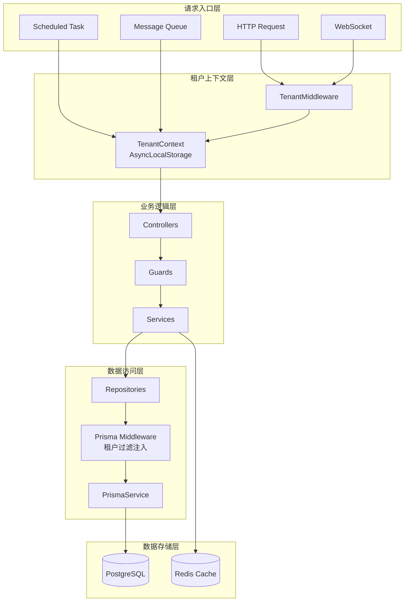

# Design Document: Multi-Tenant Architecture Refactor

> **状态**: ✅ 已完成  
> **完成日期**: 2026-01-06  
> **实施版本**: v2.1.0

## Overview

本设计文档描述了对现有 NestJS SaaS 多租户系统进行企业级架构重构的技术方案。采用**共享数据库、共享 Schema、行级隔离**的多租户模式，通过 Prisma Middleware 自动注入租户过滤，结合 AsyncLocalStorage 实现请求级租户上下文传递。

### 设计原则

1. **租户隔离优先**: 所有数据访问必须经过租户过滤，防止跨租户数据泄露
2. **自动化优于手动**: 通过中间件和装饰器自动处理租户逻辑，减少开发者心智负担
3. **类型安全**: 使用 TypeScript 严格类型，消除 any 类型
4. **可扩展性**: 支持未来升级到 Schema 隔离或数据库隔离模式
5. **性能优先**: 合理使用缓存，优化数据库查询
6. **阿里规范**: 不使用数据库外键，在应用层维护关联关系

## Architecture

### 整体架构图



### 租户隔离模式对比

| 模式 | 隔离级别 | 成本 | 复杂度 | 适用场景 |
|------|---------|------|--------|---------|
| 共享 Schema + 行级隔离 | 中 | 低 | 低 | 当前采用，适合中小规模 |
| 独立 Schema | 高 | 中 | 中 | 合规要求高的租户 |
| 独立数据库 | 最高 | 高 | 高 | 企业级大客户 |

当前系统采用**共享 Schema + 行级隔离**模式，通过 `tenantId` 字段区分租户数据。

## Components and Interfaces

### 1. 租户上下文模块 (TenantContext)

#### 接口定义

```typescript
// src/tenant/context/tenant-context.interface.ts

/**
 * 租户上下文数据接口
 */
export interface ITenantContextData {
  /** 租户ID */
  tenantId: string;
  /** 是否忽略租户过滤 */
  ignoreTenant: boolean;
  /** 用户ID（可选） */
  userId?: number;
  /** 用户名（可选） */
  userName?: string;
  /** 请求ID（用于链路追踪） */
  requestId?: string;
}

/**
 * 租户上下文服务接口
 */
export interface ITenantContextService {
  /** 获取当前租户ID */
  getTenantId(): string | undefined;
  /** 设置租户ID */
  setTenantId(tenantId: string): void;
  /** 检查是否忽略租户过滤 */
  isIgnoreTenant(): boolean;
  /** 设置忽略租户过滤 */
  setIgnoreTenant(ignore: boolean): void;
  /** 检查是否为超级租户 */
  isSuperTenant(): boolean;
  /** 在指定租户上下文中执行操作 */
  runWithTenant<T>(tenantId: string, fn: () => T | Promise<T>): T | Promise<T>;
  /** 获取完整上下文数据 */
  getStore(): ITenantContextData | undefined;
}
```

#### 实现类

```typescript
// src/tenant/context/tenant.context.ts

import { AsyncLocalStorage } from 'async_hooks';
import { Injectable } from '@nestjs/common';

export const SUPER_TENANT_ID = '000000';

@Injectable()
export class TenantContext implements ITenantContextService {
  private static storage = new AsyncLocalStorage<ITenantContextData>();

  static run<T>(data: ITenantContextData, fn: () => T): T {
    return this.storage.run(data, fn);
  }

  getTenantId(): string | undefined {
    return TenantContext.storage.getStore()?.tenantId;
  }

  setTenantId(tenantId: string): void {
    const store = TenantContext.storage.getStore();
    if (store) {
      store.tenantId = tenantId;
    }
  }

  isIgnoreTenant(): boolean {
    return TenantContext.storage.getStore()?.ignoreTenant ?? false;
  }

  setIgnoreTenant(ignore: boolean): void {
    const store = TenantContext.storage.getStore();
    if (store) {
      store.ignoreTenant = ignore;
    }
  }

  isSuperTenant(): boolean {
    return this.getTenantId() === SUPER_TENANT_ID;
  }

  runWithTenant<T>(tenantId: string, fn: () => T | Promise<T>): T | Promise<T> {
    const currentStore = TenantContext.storage.getStore();
    const newStore: ITenantContextData = {
      ...currentStore,
      tenantId,
      ignoreTenant: false,
    };
    return TenantContext.storage.run(newStore, fn);
  }

  getStore(): ITenantContextData | undefined {
    return TenantContext.storage.getStore();
  }

  // 静态方法保持向后兼容
  static getTenantId(): string | undefined {
    return this.storage.getStore()?.tenantId;
  }

  static isSuperTenant(): boolean {
    return this.getTenantId() === SUPER_TENANT_ID;
  }

  static isIgnoreTenant(): boolean {
    return this.storage.getStore()?.ignoreTenant ?? false;
  }
}
```

### 2. 租户中间件 (TenantMiddleware)

```typescript
// src/tenant/middleware/tenant-http.middleware.ts

import { Injectable, NestMiddleware, Logger } from '@nestjs/common';
import { Request, Response, NextFunction } from 'express';
import { TenantContext, ITenantContextData, SUPER_TENANT_ID } from '../context';

@Injectable()
export class TenantHttpMiddleware implements NestMiddleware {
  private readonly logger = new Logger(TenantHttpMiddleware.name);

  use(req: Request, res: Response, next: NextFunction): void {
    // 从 JWT payload 或请求头提取租户ID
    const tenantId = this.extractTenantId(req);
    
    const contextData: ITenantContextData = {
      tenantId: tenantId || SUPER_TENANT_ID,
      ignoreTenant: false,
      userId: req.user?.userId,
      userName: req.user?.userName,
      requestId: req.headers['x-request-id'] as string,
    };

    TenantContext.run(contextData, () => {
      next();
    });
  }

  private extractTenantId(req: Request): string | undefined {
    // 优先从 JWT payload 获取
    if (req.user?.tenantId) {
      return req.user.tenantId;
    }
    // 其次从请求头获取
    return req.headers['x-tenant-id'] as string;
  }
}
```

### 3. Prisma 租户中间件

#### 租户模型元数据装饰器

```typescript
// src/tenant/decorators/tenant-model.decorator.ts

import 'reflect-metadata';

const TENANT_MODEL_KEY = Symbol('TENANT_MODEL');

/**
 * 标记模型需要租户隔离
 */
export function TenantModel(): ClassDecorator {
  return (target: Function) => {
    Reflect.defineMetadata(TENANT_MODEL_KEY, true, target);
  };
}

/**
 * 检查模型是否需要租户隔离
 */
export function isTenantModel(model: Function): boolean {
  return Reflect.getMetadata(TENANT_MODEL_KEY, model) === true;
}

// 租户隔离模型注册表
export const TENANT_MODELS = new Set<string>([
  'SysConfig',
  'SysDept',
  'SysDictData',
  'SysDictType',
  'SysJob',
  'SysLogininfor',
  'SysMenu',
  'SysNotice',
  'SysOperLog',
  'SysPost',
  'SysRole',
  'SysUpload',
  'SysUser',
  'SysFileFolder',
  'SysFileShare',
  'SysAuditLog',
  'SysTenantFeature',
  'SysTenantUsage',
]);

export function hasTenantField(model: string): boolean {
  return TENANT_MODELS.has(model);
}
```

#### Prisma 中间件实现

```typescript
// src/tenant/middleware/prisma-tenant.middleware.ts

import { Prisma } from '@prisma/client';
import { TenantContext, SUPER_TENANT_ID } from '../context';
import { hasTenantField } from '../decorators/tenant-model.decorator';
import { Logger } from '@nestjs/common';

const logger = new Logger('PrismaTenantMiddleware');

// 需要添加租户过滤的查询操作
const FILTER_ACTIONS = [
  'findMany',
  'findFirst',
  'findFirstOrThrow',
  'count',
  'aggregate',
  'groupBy',
  'updateMany',
  'deleteMany',
] as const;

// 需要添加租户过滤的单条操作
const SINGLE_MODIFY_ACTIONS = ['update', 'delete'] as const;

// 创建操作
const CREATE_ACTIONS = ['create'] as const;

/**
 * 添加租户过滤条件
 */
function addTenantFilter<T extends Record<string, unknown>>(
  model: string,
  args: T,
): T {
  if (!hasTenantField(model)) return args;
  if (TenantContext.isIgnoreTenant()) return args;
  if (TenantContext.isSuperTenant()) return args;

  const tenantId = TenantContext.getTenantId();
  if (!tenantId) return args;

  const result = { ...args };
  const where = (result.where as Record<string, unknown>) || {};

  if (where.AND) {
    (where.AND as unknown[]).push({ tenantId });
  } else if (where.OR) {
    result.where = {
      AND: [{ tenantId }, { OR: where.OR }],
    };
  } else {
    where.tenantId = tenantId;
    result.where = where;
  }

  return result;
}

/**
 * 设置租户ID到创建数据
 */
function setTenantId<T extends Record<string, unknown>>(
  model: string,
  args: T,
): T {
  if (!hasTenantField(model)) return args;

  const tenantId = TenantContext.getTenantId() || SUPER_TENANT_ID;
  const result = { ...args };
  const data = (result.data as Record<string, unknown>) || {};

  if (!data.tenantId) {
    data.tenantId = tenantId;
    result.data = data;
  }

  return result;
}

/**
 * 批量创建时设置租户ID
 */
function setTenantIdForMany<T extends Record<string, unknown>>(
  model: string,
  args: T,
): T {
  if (!hasTenantField(model)) return args;

  const tenantId = TenantContext.getTenantId() || SUPER_TENANT_ID;
  const result = { ...args };

  if (Array.isArray(result.data)) {
    result.data = result.data.map((item: Record<string, unknown>) => ({
      ...item,
      tenantId: item.tenantId || tenantId,
    }));
  }

  return result;
}

/**
 * 验证查询结果的租户归属
 */
function validateTenantOwnership<T extends Record<string, unknown> | null>(
  model: string,
  result: T,
): T | null {
  if (!result || !hasTenantField(model)) return result;
  if (TenantContext.isIgnoreTenant()) return result;
  if (TenantContext.isSuperTenant()) return result;

  const currentTenantId = TenantContext.getTenantId();
  if (!currentTenantId) return result;

  if (result.tenantId && result.tenantId !== currentTenantId) {
    logger.warn(
      `Tenant ownership validation failed: expected ${currentTenantId}, got ${result.tenantId}`,
    );
    return null;
  }

  return result;
}

/**
 * 创建 Prisma 租户中间件
 */
export function createTenantMiddleware(): Prisma.Middleware {
  return async (
    params: Prisma.MiddlewareParams,
    next: (params: Prisma.MiddlewareParams) => Promise<unknown>,
  ) => {
    const { model, action, args } = params;

    if (!model) {
      return next(params);
    }

    // 查询操作：添加租户过滤
    if ((FILTER_ACTIONS as readonly string[]).includes(action)) {
      params.args = addTenantFilter(model, args);
    }
    // 单条更新/删除：添加租户过滤
    else if ((SINGLE_MODIFY_ACTIONS as readonly string[]).includes(action)) {
      params.args = addTenantFilter(model, args);
    }
    // 创建操作：设置租户ID
    else if ((CREATE_ACTIONS as readonly string[]).includes(action)) {
      params.args = setTenantId(model, args);
    }
    // 批量创建
    else if (action === 'createMany') {
      params.args = setTenantIdForMany(model, args);
    }
    // upsert
    else if (action === 'upsert') {
      params.args = addTenantFilter(model, args);
      if (params.args.create) {
        params.args.create = {
          ...params.args.create,
          tenantId:
            params.args.create.tenantId ||
            TenantContext.getTenantId() ||
            SUPER_TENANT_ID,
        };
      }
    }
    // findUnique：执行后验证
    else if (action === 'findUnique') {
      const result = await next(params);
      return validateTenantOwnership(
        model,
        result as Record<string, unknown> | null,
      );
    }

    return next(params);
  };
}
```

### 4. 功能开关服务 (FeatureToggleService)

```typescript
// src/tenant/services/feature-toggle.service.ts

export interface IFeatureToggleService {
  /** 检查功能是否启用 */
  isEnabled(tenantId: string, feature: string): Promise<boolean>;
  /** 设置功能开关 */
  setFeature(
    tenantId: string,
    feature: string,
    enabled: boolean,
    config?: Record<string, unknown>,
  ): Promise<void>;
  /** 获取租户所有功能 */
  getTenantFeatures(tenantId: string): Promise<Record<string, boolean>>;
  /** 批量设置功能 */
  setFeatures(
    tenantId: string,
    features: Record<string, boolean>,
  ): Promise<void>;
  /** 清除缓存 */
  clearCache(tenantId: string): Promise<void>;
}
```

### 5. 配额服务 (QuotaService)

```typescript
// src/tenant/services/quota.service.ts

/**
 * 配额资源类型
 */
export enum QuotaResource {
  USERS = 'users',
  STORAGE = 'storage',
  API_CALLS = 'api_calls',
}

/**
 * 配额检查结果
 */
export interface QuotaCheckResult {
  allowed: boolean;
  currentUsage: number;
  quota: number;
  remaining: number;
}

export interface IQuotaService {
  /** 检查配额 */
  checkQuota(tenantId: string, resource: QuotaResource): Promise<QuotaCheckResult>;
  /** 检查配额并抛出异常 */
  checkQuotaOrThrow(tenantId: string, resource: QuotaResource): Promise<void>;
  /** 增加使用量 */
  incrementUsage(
    tenantId: string,
    resource: QuotaResource,
    amount?: number,
  ): Promise<void>;
  /** 获取使用统计 */
  getUsageStats(
    tenantId: string,
    startDate: Date,
    endDate: Date,
  ): Promise<TenantUsageStats[]>;
}
```

### 6. 租户生命周期服务

```typescript
// src/tenant/services/tenant-lifecycle.service.ts

/**
 * 租户状态枚举
 */
export enum TenantStatus {
  /** 正常 */
  ACTIVE = '0',
  /** 禁用 */
  DISABLED = '1',
  /** 过期 */
  EXPIRED = '2',
  /** 待删除 */
  PENDING_DELETE = '3',
}

export interface ITenantLifecycleService {
  /** 创建租户并初始化基础数据 */
  createTenant(data: CreateTenantDto): Promise<SysTenant>;
  /** 更新租户状态 */
  updateStatus(tenantId: string, status: TenantStatus): Promise<void>;
  /** 检查租户是否可访问 */
  checkTenantAccessible(tenantId: string): Promise<boolean>;
  /** 导出租户数据 */
  exportTenantData(tenantId: string): Promise<TenantExportData>;
  /** 删除租户 */
  deleteTenant(tenantId: string, options?: DeleteTenantOptions): Promise<void>;
  /** 验证关联数据完整性（应用层外键检查） */
  validateRelations(tenantId: string): Promise<ValidationResult>;
}

/**
 * 关联关系验证服务
 * 
 * 由于不使用数据库外键，需要在应用层维护数据完整性
 */
export interface IRelationValidationService {
  /** 验证租户套餐是否存在 */
  validatePackageExists(packageId: number): Promise<boolean>;
  /** 验证部门是否存在 */
  validateDeptExists(tenantId: string, deptId: number): Promise<boolean>;
  /** 验证角色是否存在 */
  validateRoleExists(tenantId: string, roleId: number): Promise<boolean>;
  /** 删除前检查是否有关联数据 */
  checkDependencies(entity: string, id: number | string): Promise<DependencyCheckResult>;
}
```

### 7. 装饰器定义

```typescript
// src/tenant/decorators/index.ts

/**
 * 忽略租户过滤装饰器
 */
export const IGNORE_TENANT_KEY = 'IGNORE_TENANT';
export const IgnoreTenant = () => SetMetadata(IGNORE_TENANT_KEY, true);

/**
 * 需要特定功能装饰器
 */
export const REQUIRE_FEATURE_KEY = 'REQUIRE_FEATURE';
export const RequireFeature = (feature: string) =>
  SetMetadata(REQUIRE_FEATURE_KEY, feature);

/**
 * 需要配额检查装饰器
 */
export const REQUIRE_QUOTA_KEY = 'REQUIRE_QUOTA';
export const RequireQuota = (resource: QuotaResource) =>
  SetMetadata(REQUIRE_QUOTA_KEY, resource);
```

## Data Models

### 核心枚举定义

```typescript
// src/shared/enums/status.enum.ts

/**
 * 通用状态枚举
 */
export enum Status {
  /** 正常 */
  NORMAL = '0',
  /** 停用 */
  DISABLED = '1',
}

/**
 * 删除标志枚举
 */
export enum DelFlag {
  /** 正常 */
  NORMAL = '0',
  /** 已删除 */
  DELETED = '2',
}

/**
 * 租户状态枚举
 */
export enum TenantStatus {
  /** 正常 */
  ACTIVE = '0',
  /** 禁用 */
  DISABLED = '1',
  /** 过期 */
  EXPIRED = '2',
  /** 待删除 */
  PENDING_DELETE = '3',
}
```

### Prisma Schema 优化建议

遵循阿里开发规范，**不使用数据库外键约束**，关联关系在应用层维护。

```prisma
// prisma/schema.prisma (部分)

/// 租户表
model SysTenant {
  id              Int       @id @default(autoincrement())
  tenantId        String    @unique @map("tenant_id") @db.VarChar(20)
  contactUserName String?   @map("contact_user_name") @db.VarChar(50)
  contactPhone    String?   @map("contact_phone") @db.VarChar(20)
  companyName     String    @map("company_name") @db.VarChar(100)
  licenseNumber   String?   @map("license_number") @db.VarChar(50)
  address         String?   @db.VarChar(200)
  intro           String?   @db.Text
  domain          String?   @db.VarChar(100)
  packageId       Int?      @map("package_id")  // 关联 SysTenantPackage.packageId，应用层维护
  expireTime      DateTime? @map("expire_time") @db.Timestamp(6)
  accountCount    Int       @default(-1) @map("account_count")
  storageQuota    Int       @default(10240) @map("storage_quota")
  storageUsed     Int       @default(0) @map("storage_used")
  apiQuota        Int       @default(10000) @map("api_quota")
  status          String    @default("0") @db.Char(1)
  delFlag         String    @default("0") @map("del_flag") @db.Char(1)
  createBy        String    @default("") @map("create_by") @db.VarChar(64)
  createTime      DateTime? @map("create_time") @default(dbgenerated("CURRENT_TIMESTAMP")) @db.Timestamp(6)
  updateBy        String    @default("") @map("update_by") @db.VarChar(64)
  updateTime      DateTime? @map("update_time") @default(dbgenerated("CURRENT_TIMESTAMP")) @db.Timestamp(6)
  remark          String?   @db.VarChar(500)

  @@index([status, delFlag])
  @@index([expireTime])
  @@index([domain])
  @@index([packageId])  // 添加索引优化关联查询
  @@map("sys_tenant")
}

/// 租户套餐表
model SysTenantPackage {
  packageId          Int       @id @default(autoincrement()) @map("package_id")
  packageName        String    @map("package_name") @db.VarChar(50)
  menuIds            String?   @map("menu_ids") @db.Text
  menuCheckStrictly  Boolean   @default(false) @map("menu_check_strictly")
  status             String    @default("0") @db.Char(1)
  delFlag            String    @default("0") @map("del_flag") @db.Char(1)
  createBy           String    @default("") @map("create_by") @db.VarChar(64)
  createTime         DateTime? @map("create_time") @default(dbgenerated("CURRENT_TIMESTAMP")) @db.Timestamp(6)
  updateBy           String    @default("") @map("update_by") @db.VarChar(64)
  updateTime         DateTime? @map("update_time") @default(dbgenerated("CURRENT_TIMESTAMP")) @db.Timestamp(6)
  remark             String?   @db.VarChar(500)

  @@map("sys_tenant_package")
}

/// 用户表
model SysUser {
  userId      Int       @id @default(autoincrement()) @map("user_id")
  tenantId    String    @default("000000") @map("tenant_id") @db.VarChar(20)
  deptId      Int?      @map("dept_id")  // 关联 SysDept.deptId，应用层维护
  userName    String    @map("user_name") @db.VarChar(30)
  nickName    String    @map("nick_name") @db.VarChar(30)
  userType    String    @map("user_type") @db.VarChar(2)
  email       String    @default("") @db.VarChar(50)
  phonenumber String    @default("") @db.VarChar(11)
  sex         String    @default("0") @db.Char(1)
  avatar      String    @default("") @db.VarChar(255)
  password    String    @db.VarChar(200)
  status      String    @default("0") @db.Char(1)
  delFlag     String    @default("0") @map("del_flag") @db.Char(1)
  loginIp     String    @default("") @map("login_ip") @db.VarChar(128)
  loginDate   DateTime? @map("login_date") @db.Timestamp(6)
  createBy    String    @default("") @map("create_by") @db.VarChar(64)
  createTime  DateTime? @map("create_time") @default(dbgenerated("CURRENT_TIMESTAMP")) @db.Timestamp(6)
  updateBy    String    @default("") @map("update_by") @db.VarChar(64)
  updateTime  DateTime? @map("update_time") @default(dbgenerated("CURRENT_TIMESTAMP")) @db.Timestamp(6)
  remark      String?   @db.VarChar(500)

  @@index([tenantId, status])
  @@index([tenantId, userName])
  @@index([tenantId, deptId])  // 添加索引优化关联查询
  @@index([deptId])
  @@map("sys_user")
}
```

**关联关系维护原则**：
1. 数据库层：只保留字段和索引，不创建外键约束
2. 应用层：通过 Service 层方法维护数据一致性
3. 查询优化：为关联字段添加索引提升查询性能
4. 数据完整性：通过应用层事务和业务逻辑保证

### 缓存键设计

```typescript
// src/tenant/constants/cache-keys.ts

export const TenantCacheKeys = {
  /** 租户信息缓存 */
  TENANT_INFO: (tenantId: string) => `tenant:info:${tenantId}`,
  /** 租户功能开关缓存 */
  TENANT_FEATURES: (tenantId: string) => `tenant:features:${tenantId}`,
  /** 租户配额缓存 */
  TENANT_QUOTA: (tenantId: string) => `tenant:quota:${tenantId}`,
  /** 租户使用量缓存 */
  TENANT_USAGE: (tenantId: string, resource: string, date: string) =>
    `tenant:usage:${tenantId}:${resource}:${date}`,
  /** 租户套餐缓存 */
  TENANT_PACKAGE: (packageId: number) => `tenant:package:${packageId}`,
} as const;

export const TenantCacheTTL = {
  /** 租户信息缓存时间（秒） */
  TENANT_INFO: 300,
  /** 功能开关缓存时间（秒） */
  FEATURES: 300,
  /** 配额缓存时间（秒） */
  QUOTA: 300,
  /** 使用量缓存时间（秒） */
  USAGE: 60,
} as const;
```


## Correctness Properties

*A property is a characteristic or behavior that should hold true across all valid executions of a system—essentially, a formal statement about what the system should do. Properties serve as the bridge between human-readable specifications and machine-verifiable correctness guarantees.*

### Property 1: Tenant Context Propagation

*For any* HTTP request, WebSocket connection, scheduled task, or message queue handler that enters the system with a valid tenant identifier, the tenant context SHALL be accessible throughout the entire request lifecycle, including within nested async operations (Promises, setTimeout callbacks).

**Validates: Requirements 1.1, 1.2, 1.4**

### Property 2: Tenant Context Switching

*For any* super tenant user executing a cross-tenant operation using `runWithTenant()`, the nested operation SHALL execute with the specified tenant context, and the original context SHALL be restored after the operation completes.

**Validates: Requirements 1.5**

### Property 3: Prisma Middleware Tenant Filter Injection

*For any* query operation (findMany, findFirst, count, aggregate, updateMany, deleteMany) on a tenant-isolated model, when executed by a non-super tenant with tenant context initialized, the Prisma middleware SHALL automatically inject `tenantId = currentTenantId` into the WHERE clause.

**Validates: Requirements 2.1, 5.1**

### Property 4: Prisma Middleware Auto-Set TenantId on Create

*For any* create operation (create, createMany, upsert) on a tenant-isolated model, when the input data does not include tenantId, the Prisma middleware SHALL automatically set tenantId to the current tenant context value.

**Validates: Requirements 2.2**

### Property 5: FindUnique Tenant Ownership Validation

*For any* findUnique query result on a tenant-isolated model, if the result's tenantId does not match the current tenant context (and the context is not super tenant or ignore mode), the system SHALL return null instead of the actual record.

**Validates: Requirements 2.4**

### Property 6: Transaction Tenant Isolation

*For any* database transaction containing multiple operations on tenant-isolated models, all operations within the transaction SHALL maintain the same tenant context and apply consistent tenant filtering.

**Validates: Requirements 2.5**

### Property 7: Super Tenant Bypass

*For any* query operation executed with super tenant context (tenantId = '000000'), the Prisma middleware SHALL NOT inject tenant filter conditions, allowing cross-tenant data access.

**Validates: Requirements 2.6**

### Property 8: IgnoreTenant Decorator Bypass

*For any* request handler decorated with @IgnoreTenant, all database operations within that handler SHALL skip tenant filtering regardless of the current tenant context.

**Validates: Requirements 2.7**

### Property 9: Feature Toggle Check

*For any* tenant and feature combination, the FeatureToggleService.isEnabled() method SHALL return true if and only if the feature is explicitly enabled for that tenant in the database or cache.

**Validates: Requirements 3.2**

### Property 10: Package Change Feature Update

*For any* tenant package change operation, all features defined in the new package SHALL be automatically enabled for the tenant, and features not in the new package SHALL be disabled.

**Validates: Requirements 3.5**

### Property 11: Quota Check and Enforcement

*For any* resource type (users, storage, api_calls) and tenant, when the current usage equals or exceeds the quota limit (and quota is not -1 for unlimited), the QuotaService.checkQuota() SHALL return `allowed: false`, and checkQuotaOrThrow() SHALL throw a BusinessException.

**Validates: Requirements 4.1, 4.2, 4.3**

### Property 12: Cross-Tenant Access Prevention

*For any* authenticated user attempting to access data belonging to a different tenant (via direct ID reference or query manipulation), the system SHALL return a 403 Forbidden error or empty result, never exposing cross-tenant data.

**Validates: Requirements 5.2**

### Property 13: Cross-Tenant Audit Logging

*For any* operation that accesses or modifies data across tenant boundaries (by super tenant or system processes), the system SHALL create an audit log entry containing the source tenant, target tenant, operation type, and timestamp.

**Validates: Requirements 5.3**

### Property 14: Sensitive Data Encryption Round-Trip

*For any* sensitive field value that is encrypted before storage, decrypting the stored value SHALL produce the original plaintext value (encryption/decryption round-trip identity).

**Validates: Requirements 5.4**

### Property 15: Tenant Initialization

*For any* newly created tenant, the system SHALL automatically create: one admin user with the tenant admin role, one default department, and one tenant admin role with full permissions for that tenant.

**Validates: Requirements 6.1**

### Property 16: Disabled Tenant Login Block

*For any* tenant with status = 'DISABLED' or 'EXPIRED', all login attempts by users belonging to that tenant SHALL be rejected with an appropriate error message.

**Validates: Requirements 6.3**

### Property 17: Cache Tenant Isolation

*For any* cached data that is tenant-specific, the cache key SHALL include the tenant identifier, ensuring that cache lookups for one tenant never return data cached for another tenant.

**Validates: Requirements 7.2**

### Property 18: Tenant Rate Limiting

*For any* tenant, when the API request rate exceeds the configured limit for that tenant, subsequent requests SHALL be rejected with a 429 Too Many Requests response until the rate window resets.

**Validates: Requirements 7.5**

## Error Handling

### 错误码定义

```typescript
// src/shared/response/response-code.enum.ts

export enum TenantErrorCode {
  /** 租户不存在 */
  TENANT_NOT_FOUND = 'T001',
  /** 租户已禁用 */
  TENANT_DISABLED = 'T002',
  /** 租户已过期 */
  TENANT_EXPIRED = 'T003',
  /** 租户上下文未初始化 */
  TENANT_CONTEXT_NOT_INITIALIZED = 'T004',
  /** 跨租户访问被拒绝 */
  CROSS_TENANT_ACCESS_DENIED = 'T005',
  /** 功能未启用 */
  FEATURE_NOT_ENABLED = 'T006',
  /** 配额超限 */
  QUOTA_EXCEEDED = 'T007',
  /** 租户数据验证失败 */
  TENANT_DATA_VALIDATION_FAILED = 'T008',
}
```

### 异常类定义

```typescript
// src/tenant/exceptions/tenant.exception.ts

import { HttpException, HttpStatus } from '@nestjs/common';
import { TenantErrorCode } from 'src/shared/response';

export class TenantException extends HttpException {
  constructor(
    public readonly code: TenantErrorCode,
    message: string,
    status: HttpStatus = HttpStatus.FORBIDDEN,
  ) {
    super({ code, message }, status);
  }
}

export class TenantNotFoundError extends TenantException {
  constructor(tenantId: string) {
    super(
      TenantErrorCode.TENANT_NOT_FOUND,
      `租户 ${tenantId} 不存在`,
      HttpStatus.NOT_FOUND,
    );
  }
}

export class TenantDisabledError extends TenantException {
  constructor(tenantId: string) {
    super(
      TenantErrorCode.TENANT_DISABLED,
      `租户 ${tenantId} 已被禁用`,
      HttpStatus.FORBIDDEN,
    );
  }
}

export class TenantContextNotInitializedError extends TenantException {
  constructor() {
    super(
      TenantErrorCode.TENANT_CONTEXT_NOT_INITIALIZED,
      '租户上下文未初始化，请确保请求包含有效的租户信息',
      HttpStatus.UNAUTHORIZED,
    );
  }
}

export class CrossTenantAccessDeniedError extends TenantException {
  constructor() {
    super(
      TenantErrorCode.CROSS_TENANT_ACCESS_DENIED,
      '无权访问其他租户的数据',
      HttpStatus.FORBIDDEN,
    );
  }
}

export class FeatureNotEnabledError extends TenantException {
  constructor(feature: string) {
    super(
      TenantErrorCode.FEATURE_NOT_ENABLED,
      `功能 ${feature} 未启用`,
      HttpStatus.FORBIDDEN,
    );
  }
}

export class QuotaExceededError extends TenantException {
  constructor(resource: string, current: number, limit: number) {
    super(
      TenantErrorCode.QUOTA_EXCEEDED,
      `${resource} 配额已用尽，当前使用: ${current}，配额上限: ${limit}`,
      HttpStatus.TOO_MANY_REQUESTS,
    );
  }
}
```

### 全局异常过滤器增强

```typescript
// src/core/filters/tenant-exception.filter.ts

import { ExceptionFilter, Catch, ArgumentsHost, Logger } from '@nestjs/common';
import { Response } from 'express';
import { TenantException } from 'src/tenant/exceptions';
import { TenantContext } from 'src/tenant/context';

@Catch(TenantException)
export class TenantExceptionFilter implements ExceptionFilter {
  private readonly logger = new Logger(TenantExceptionFilter.name);

  catch(exception: TenantException, host: ArgumentsHost): void {
    const ctx = host.switchToHttp();
    const response = ctx.getResponse<Response>();
    const status = exception.getStatus();

    const tenantId = TenantContext.getTenantId() || 'unknown';

    this.logger.warn(
      `Tenant exception [${exception.code}]: ${exception.message} (tenant: ${tenantId})`,
    );

    response.status(status).json({
      code: exception.code,
      message: exception.message,
      timestamp: new Date().toISOString(),
    });
  }
}
```

## Testing Strategy

### 测试框架选择

- **单元测试**: Jest
- **属性测试**: fast-check (Property-Based Testing)
- **集成测试**: Jest + Supertest
- **E2E 测试**: Jest + Supertest

### 测试目录结构

```
server/test/
├── unit/
│   └── tenant/
│       ├── tenant.context.spec.ts
│       ├── tenant.middleware.spec.ts
│       ├── feature-toggle.service.spec.ts
│       └── quota.service.spec.ts
├── integration/
│   └── tenant/
│       ├── tenant-isolation.spec.ts
│       └── cross-tenant-access.spec.ts
├── e2e/
│   └── tenant/
│       ├── tenant-lifecycle.e2e-spec.ts
│       └── tenant-quota.e2e-spec.ts
└── property/
    └── tenant/
        ├── tenant-filter.property.spec.ts
        ├── quota-enforcement.property.spec.ts
        └── cache-isolation.property.spec.ts
```

### 属性测试示例

```typescript
// test/property/tenant/tenant-filter.property.spec.ts

import * as fc from 'fast-check';
import { TenantContext } from 'src/tenant/context';
import { addTenantFilter, hasTenantField } from 'src/tenant/middleware';

describe('Tenant Filter Properties', () => {
  /**
   * Feature: multi-tenant-architecture-refactor
   * Property 3: Prisma Middleware Tenant Filter Injection
   * Validates: Requirements 2.1, 5.1
   */
  it('should inject tenantId filter for all tenant-isolated model queries', () => {
    fc.assert(
      fc.property(
        fc.constantFrom(...TENANT_MODELS), // 租户隔离模型
        fc.string({ minLength: 6, maxLength: 6 }), // 租户ID
        fc.record({ status: fc.constantFrom('0', '1') }), // 原始 where 条件
        (model, tenantId, originalWhere) => {
          // 设置租户上下文
          return TenantContext.run({ tenantId, ignoreTenant: false }, () => {
            const result = addTenantFilter(model, { where: originalWhere });
            
            // 验证 tenantId 被注入
            expect(result.where.tenantId).toBe(tenantId);
            // 验证原始条件保留
            expect(result.where.status).toBe(originalWhere.status);
            return true;
          });
        },
      ),
      { numRuns: 100 },
    );
  });

  /**
   * Feature: multi-tenant-architecture-refactor
   * Property 7: Super Tenant Bypass
   * Validates: Requirements 2.6
   */
  it('should skip tenant filter for super tenant', () => {
    fc.assert(
      fc.property(
        fc.constantFrom(...TENANT_MODELS),
        fc.record({ status: fc.constantFrom('0', '1') }),
        (model, originalWhere) => {
          return TenantContext.run(
            { tenantId: '000000', ignoreTenant: false },
            () => {
              const result = addTenantFilter(model, { where: originalWhere });
              
              // 超级租户不应注入 tenantId 过滤
              expect(result.where.tenantId).toBeUndefined();
              return true;
            },
          );
        },
      ),
      { numRuns: 100 },
    );
  });
});
```

### 单元测试示例

```typescript
// test/unit/tenant/quota.service.spec.ts

describe('QuotaService', () => {
  describe('checkQuota', () => {
    it('should return allowed=false when usage exceeds quota', async () => {
      // 设置租户配额为 10
      mockPrisma.sysTenant.findUnique.mockResolvedValue({
        accountCount: 10,
        storageQuota: 1024,
        apiQuota: 1000,
      });
      
      // 设置当前使用量为 10
      mockPrisma.sysUser.count.mockResolvedValue(10);

      const result = await quotaService.checkQuota('tenant1', QuotaResource.USERS);

      expect(result.allowed).toBe(false);
      expect(result.currentUsage).toBe(10);
      expect(result.quota).toBe(10);
      expect(result.remaining).toBe(0);
    });

    it('should return allowed=true when quota is unlimited (-1)', async () => {
      mockPrisma.sysTenant.findUnique.mockResolvedValue({
        accountCount: -1, // 无限制
        storageQuota: 1024,
        apiQuota: 1000,
      });
      
      mockPrisma.sysUser.count.mockResolvedValue(1000);

      const result = await quotaService.checkQuota('tenant1', QuotaResource.USERS);

      expect(result.allowed).toBe(true);
      expect(result.quota).toBe(-1);
      expect(result.remaining).toBe(-1);
    });
  });
});
```

### 集成测试示例

```typescript
// test/integration/tenant/tenant-isolation.spec.ts

describe('Tenant Isolation Integration', () => {
  /**
   * Feature: multi-tenant-architecture-refactor
   * Property 12: Cross-Tenant Access Prevention
   * Validates: Requirements 5.2
   */
  it('should prevent cross-tenant data access', async () => {
    // 创建两个租户的数据
    const tenant1User = await createUser({ tenantId: 'tenant1', userName: 'user1' });
    const tenant2User = await createUser({ tenantId: 'tenant2', userName: 'user2' });

    // 以 tenant1 身份查询
    const result = await TenantContext.run(
      { tenantId: 'tenant1', ignoreTenant: false },
      async () => {
        return prisma.sysUser.findMany({});
      },
    );

    // 只能看到 tenant1 的数据
    expect(result).toHaveLength(1);
    expect(result[0].tenantId).toBe('tenant1');
    expect(result.find(u => u.tenantId === 'tenant2')).toBeUndefined();
  });
});
```

### 测试配置

```typescript
// jest.config.js

module.exports = {
  moduleFileExtensions: ['js', 'json', 'ts'],
  rootDir: '.',
  testRegex: '.*\\.spec\\.ts$',
  transform: {
    '^.+\\.(t|j)s$': 'ts-jest',
  },
  collectCoverageFrom: [
    'src/tenant/**/*.ts',
    '!src/tenant/**/*.d.ts',
    '!src/tenant/**/index.ts',
  ],
  coverageDirectory: './coverage',
  coverageThreshold: {
    'src/tenant/': {
      branches: 80,
      functions: 80,
      lines: 80,
      statements: 80,
    },
  },
  testEnvironment: 'node',
  moduleNameMapper: {
    '^src/(.*)$': '<rootDir>/src/$1',
  },
};
```

### 测试数据工厂

```typescript
// test/fixtures/tenant.factory.ts

import { faker } from '@faker-js/faker';

export const createTenantData = (overrides = {}) => ({
  tenantId: faker.string.alphanumeric(6),
  companyName: faker.company.name(),
  contactUserName: faker.person.fullName(),
  contactPhone: faker.phone.number(),
  status: '0',
  delFlag: '0',
  accountCount: 10,
  storageQuota: 1024,
  apiQuota: 1000,
  ...overrides,
});

export const createUserData = (tenantId: string, overrides = {}) => ({
  tenantId,
  userName: faker.internet.userName(),
  nickName: faker.person.fullName(),
  email: faker.internet.email(),
  password: faker.internet.password(),
  status: '0',
  delFlag: '0',
  userType: '00',
  ...overrides,
});
```

## Implementation Notes

### 阿里开发规范遵循

#### 不使用外键约束

遵循阿里开发规范，**禁止使用外键约束**，原因如下：

1. **性能考虑**：外键约束会增加数据库负担，影响写入性能
2. **扩展性**：便于数据库分库分表和水平扩展
3. **灵活性**：避免级联操作带来的不可控风险
4. **可维护性**：关联关系在应用层更清晰可控

#### 应用层关联维护策略

```typescript
// src/shared/services/relation-validation.service.ts

@Injectable()
export class RelationValidationService implements IRelationValidationService {
  constructor(private readonly prisma: PrismaService) {}

  /**
   * 验证租户套餐是否存在
   */
  async validatePackageExists(packageId: number): Promise<boolean> {
    if (!packageId) return true; // null 值允许
    
    const count = await this.prisma.sysTenantPackage.count({
      where: { packageId, delFlag: '0' },
    });
    
    if (count === 0) {
      throw new BusinessException(
        ResponseCode.BAD_REQUEST,
        `租户套餐 ${packageId} 不存在`,
      );
    }
    
    return true;
  }

  /**
   * 验证部门是否存在
   */
  async validateDeptExists(tenantId: string, deptId: number): Promise<boolean> {
    if (!deptId) return true;
    
    const count = await this.prisma.sysDept.count({
      where: { tenantId, deptId, delFlag: '0' },
    });
    
    if (count === 0) {
      throw new BusinessException(
        ResponseCode.BAD_REQUEST,
        `部门 ${deptId} 不存在`,
      );
    }
    
    return true;
  }

  /**
   * 删除前检查依赖关系
   */
  async checkDependencies(
    entity: string,
    id: number | string,
  ): Promise<DependencyCheckResult> {
    const dependencies: string[] = [];

    switch (entity) {
      case 'tenant':
        // 检查租户下是否有用户
        const userCount = await this.prisma.sysUser.count({
          where: { tenantId: id as string, delFlag: '0' },
        });
        if (userCount > 0) {
          dependencies.push(`存在 ${userCount} 个用户`);
        }
        break;

      case 'dept':
        // 检查部门下是否有用户
        const deptUserCount = await this.prisma.sysUser.count({
          where: { deptId: id as number, delFlag: '0' },
        });
        if (deptUserCount > 0) {
          dependencies.push(`存在 ${deptUserCount} 个用户`);
        }
        break;

      case 'role':
        // 检查角色是否被用户使用
        const roleUserCount = await this.prisma.sysUserRole.count({
          where: { roleId: id as number },
        });
        if (roleUserCount > 0) {
          dependencies.push(`被 ${roleUserCount} 个用户使用`);
        }
        break;
    }

    return {
      hasDependencies: dependencies.length > 0,
      dependencies,
    };
  }
}
```

#### 数据完整性保证

1. **创建时验证**：在创建记录前验证关联数据是否存在
2. **更新时验证**：更新关联字段时验证新值的有效性
3. **删除时检查**：删除前检查是否有依赖数据
4. **事务保证**：使用数据库事务保证操作原子性

```typescript
// 示例：创建用户时验证部门
async createUser(data: CreateUserDto): Promise<SysUser> {
  // 验证部门是否存在
  if (data.deptId) {
    await this.relationValidation.validateDeptExists(data.tenantId, data.deptId);
  }

  // 使用事务创建用户和关联关系
  return this.prisma.$transaction(async (tx) => {
    const user = await tx.sysUser.create({ data });
    
    // 创建用户角色关联
    if (data.roleIds?.length > 0) {
      await tx.sysUserRole.createMany({
        data: data.roleIds.map(roleId => ({
          userId: user.userId,
          roleId,
        })),
      });
    }
    
    return user;
  });
}
```

### 迁移策略

1. **Phase 1**: 类型安全改造
   - 消除 any 类型
   - 引入枚举替代魔法字符串
   - 统一 Logger 使用

2. **Phase 2**: 租户上下文增强
   - 重构 TenantContext 类
   - 增强中间件
   - 添加装饰器

3. **Phase 3**: Prisma 中间件优化
   - 重构租户过滤逻辑
   - 添加模型元数据检测
   - 增强事务支持

4. **Phase 4**: 服务层增强
   - 完善 FeatureToggleService
   - 完善 QuotaService
   - 添加 TenantLifecycleService

5. **Phase 5**: 测试覆盖
   - 添加属性测试
   - 添加集成测试
   - 提升覆盖率

### 向后兼容性

- 保留现有 API 接口
- 通过 `@deprecated` 标记废弃方法
- 提供迁移指南文档

### 性能考虑

- 租户信息缓存 TTL: 5 分钟
- 功能开关缓存 TTL: 5 分钟
- 配额信息缓存 TTL: 5 分钟
- 使用量缓存 TTL: 1 分钟（实时性要求高）

### 监控指标

- 租户请求量 (per tenant)
- 租户错误率 (per tenant)
- 配额使用率 (per tenant, per resource)
- 缓存命中率 (tenant cache)

## Code Cleanup Plan

### 待删除的文件和目录

根据代码分析，以下文件/目录应该被删除：

#### 1. 示例和废弃代码

| 文件路径 | 删除原因 |
|---------|---------|
| `src/config/config-example.service.ts` | 示例代码，不应存在于生产代码中 |
| `src/tenant/extensions/tenant.extension.ts` | 已标记 @deprecated，功能已迁移到 middleware |
| `src/tenant/extensions/` 目录 | 整个目录可删除 |

#### 2. 重复和冗余逻辑

| 位置 | 问题 | 处理方式 |
|-----|------|---------|
| `TenantHelper.TENANT_MODELS` | 与 `tenant.middleware.ts` 中的 `TENANT_MODELS` 重复 | 统一到一处定义 |
| `TenantHelper.hasTenantField()` | 与 middleware 中的同名函数重复 | 删除 Helper 中的版本 |

#### 3. 需要清理的代码模式

```typescript
// ❌ 删除：console.log 调用
console.log(`应用运行在 ${env} 环境，端口 ${port}，前缀 ${prefix}`);

// ✅ 替换为：Logger
this.logger.log(`应用运行在 ${env} 环境，端口 ${port}，前缀 ${prefix}`);
```

### 目录结构优化

#### 当前问题

```
src/core/
├── interceptor/     # ❌ 单数命名
├── interceptors/    # ❌ 复数命名，重复
```

#### 优化后

```
src/core/
├── interceptors/    # ✅ 统一使用复数
├── decorators/
├── filters/
├── guards/
├── middleware/
```

### 租户模块精简

#### 当前结构

```
src/tenant/
├── context/
├── decorators/
├── extensions/      # ❌ 废弃，待删除
├── guards/
├── middleware/
├── services/
│   ├── tenant.helper.ts      # 部分功能与 middleware 重复
│   ├── feature-toggle.service.ts
│   ├── quota.service.ts
│   └── tenant-export.service.ts
```

#### 优化后结构

```
src/tenant/
├── context/
│   └── tenant.context.ts
├── decorators/
│   ├── ignore-tenant.decorator.ts
│   ├── require-feature.decorator.ts
│   └── require-quota.decorator.ts
├── guards/
│   ├── tenant.guard.ts
│   ├── feature.guard.ts
│   └── quota.guard.ts
├── middleware/
│   ├── tenant-http.middleware.ts
│   └── prisma-tenant.middleware.ts
├── services/
│   ├── feature-toggle.service.ts
│   ├── quota.service.ts
│   ├── tenant-lifecycle.service.ts
│   └── relation-validation.service.ts
├── constants/
│   ├── tenant-models.ts      # 统一的租户模型列表
│   └── cache-keys.ts
└── tenant.module.ts
```

### 服务层精简

#### TenantHelper 重构

```typescript
// ❌ 删除：TenantHelper 中的重复方法
// 以下方法已在 prisma-tenant.middleware.ts 中实现
// - addTenantFilter()
// - setTenantId()
// - setTenantIdForMany()
// - hasTenantField()

// ✅ 保留：TenantHelper 仅保留必要的辅助方法
@Injectable()
export class TenantHelper {
  constructor(private config: AppConfigService) {}

  /** 检查租户功能是否启用 */
  isEnabled(): boolean {
    return this.config.tenant.enabled;
  }

  /** 获取当前租户ID */
  getTenantId(): string {
    return TenantContext.getTenantId() || SUPER_TENANT_ID;
  }

  /** 检查是否应该过滤 */
  shouldFilter(): boolean {
    if (!this.isEnabled()) return false;
    if (TenantContext.isIgnoreTenant()) return false;
    if (TenantContext.isSuperTenant()) return false;
    return !!TenantContext.getTenantId();
  }
}
```

### 依赖清理

检查并移除 `package.json` 中未使用的依赖：

```bash
# 使用 depcheck 检查未使用的依赖
npx depcheck

# 常见可能未使用的依赖
# - 开发时引入但未实际使用的库
# - 已被其他库替代的旧依赖
```

### 清理检查清单

- [ ] 删除 `config-example.service.ts`
- [ ] 删除 `tenant/extensions/` 目录
- [ ] 合并重复的 `TENANT_MODELS` 定义
- [ ] 精简 `TenantHelper`，删除重复方法
- [ ] 统一目录命名为复数形式
- [ ] 替换所有 `console.log` 为 `Logger`
- [ ] 运行 `depcheck` 清理未使用依赖
- [ ] 删除空的 index.ts 导出文件
- [ ] 移除未使用的类型定义
