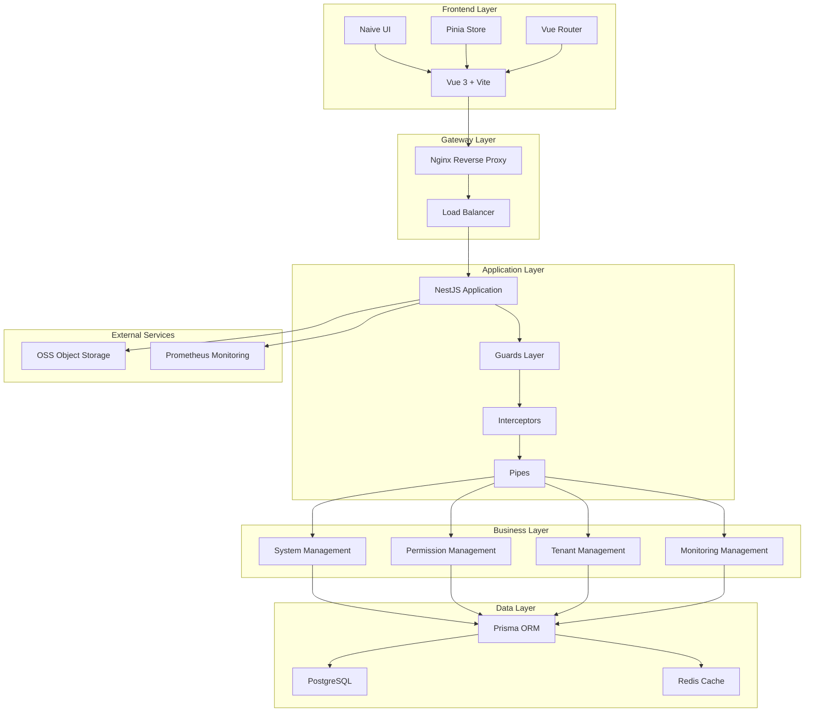
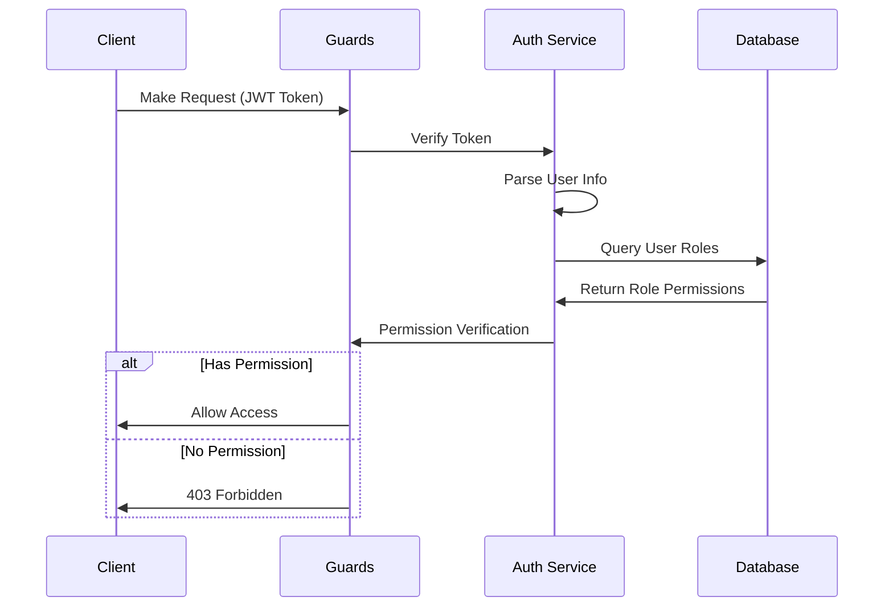

# Nest-Admin-Soybean

<div align="center">


[](LICENSE)
[](https://nodejs.org)
[](https://pnpm.io)
[](https://nestjs.com/)
[](https://vuejs.org/)
[](https://vitejs.dev/)
[](https://www.typescriptlang.org/)
[-brightgreen)](server/docs/OPTIMIZATION_README.md)
[](server/docs/OPTIMIZATION_README.md)
[](server/coverage/)

**Modern Enterprise-Grade Admin Management System Based on Vue3 + NestJS**

Integrated with powerful permission management, multi-tenant architecture, request encryption, and comprehensive logging & monitoring

[Live Demo](https://www.linlingqin.top/) | [Quick Start](#quick-start) | [Documentation](#documentation) | [Changelog](CHANGELOG.md) | [🎯 Optimization Report](server/docs/OPTIMIZATION_README.md)

**🎮 Demo Account**
- Username: `demo` | Password: `demo123` | Tenant: `000000`
- ✅ View access to all menus (21 functional modules)
- ❌ Write operations (create, update, delete) are disabled
- 📖 [Detailed Permission Guide](docs/TEST_ACCOUNTS.md)

</div>


## ✨ Features

### 🎯 Core Features
- 🔐 **Enterprise Multi-Tenant Architecture** - Complete tenant isolation, feature toggles, quota management, lifecycle management
- 👥 **RBAC Permission Management** - Role-based access control with fine-grained permissions
- 🔒 **Request Encryption** - AES + RSA hybrid encryption to protect sensitive data transmission
- 📊 **System Monitoring** - Prometheus metrics, health checks, real-time performance monitoring
- 📝 **Operation Logs** - Complete user operation trail records
- 🎮 **Demo Mode** - Read-only account system designed specifically for demo sites
- 🌐 **Internationalization** - Support for Chinese/English switching
- 🎨 **Theme Customization** - Multiple theme presets with dark mode support
- 📱 **Responsive Design** - Perfect adaptation to various screen sizes
- 📨 **Message Center** - Unified management of SMS, email, and in-app messages (🆕 New)
- 📈 **Tenant Dashboard** - Tenant statistics, trend analysis, quota monitoring (🆕 New)

### 🛠️ Tech Stack

#### Backend Technologies
- **Framework**: NestJS 10.x - Enterprise-grade Node.js framework
- **ORM**: Prisma 5.x - Type-safe modern ORM
- **Database**: PostgreSQL 14+ - Powerful relational database
- **Cache**: Redis 7+ - High-performance caching and session storage
- **Authentication**: JWT + Passport - Secure authentication
- **Logging**: Pino + Winston - High-performance structured logging
- **Scheduling**: @nestjs/schedule + Bull - Scheduled tasks and queues
- **Monitoring**: Prometheus + Terminus - Health checks and metrics collection
- **Documentation**: Swagger/OpenAPI - Auto-generated API documentation
- **Testing**: Jest + fast-check - Unit testing and property-based testing

#### Frontend Technologies
- **Framework**: Vue 3.5+ - Progressive JavaScript framework
- **Build Tool**: Vite 7.x - Next-generation frontend build tool
- **UI Framework**: Naive UI 2.43+ - Lightweight Vue 3 component library
- **State Management**: Pinia 3.x - Official Vue 3 state management
- **Routing**: Vue Router 4 + Elegant Router - File-based routing
- **CSS**: UnoCSS - Atomic CSS engine
- **HTTP Client**: Axios - HTTP client
- **Type Safety**: TypeScript 5.x - Type safety
- **Testing**: Vitest + Cypress + fast-check - Unit/E2E/Property-based testing

---

## 📐 System Architecture

### Overall Architecture Diagram



### Multi-Tenant Architecture

```
┌─────────────────────────────────────────────────────────────┐
│                      HTTP Request Layer                     │
│  ┌─────────────────────────────────────────────────────┐   │
│  │           TenantHttpMiddleware                       │   │
│  │  - Extract tenant ID from JWT/Header/Query          │   │
│  │  - Initialize TenantContext (AsyncLocalStorage)     │   │
│  └─────────────────────────────────────────────────────┘   │
└─────────────────────────────────────────────────────────────┘
                              │
                              ▼
┌─────────────────────────────────────────────────────────────┐
│                     Data Access Layer                       │
│  ┌─────────────────────────────────────────────────────┐   │
│  │           Prisma Tenant Middleware                   │   │
│  │  - Automatically inject tenantId filter conditions  │   │
│  │  - Automatically set tenantId for created data      │   │
│  │  - Verify tenant ownership for findUnique results   │   │
│  └─────────────────────────────────────────────────────┘   │
└─────────────────────────────────────────────────────────────┘
```

**Core Components:**
- `TenantContext` - Tenant context implemented with AsyncLocalStorage
- `TenantHttpMiddleware` - HTTP request tenant identification
- `Prisma Tenant Middleware` - Automatic tenant filtering at data layer
- `TenantLifecycleService` - Tenant lifecycle management
- `FeatureToggleService` - Feature toggle service
- `TenantQuotaService` - Quota management service
- `RelationValidationService` - Application layer relation validation (no foreign keys)

📖 [Detailed Documentation](docs/guide/multi-tenant.md)

### Permission Control Flow



---

## 🎨 Functional Modules

### 1️⃣ System Management
- **User Management** - User CRUD, password reset, role assignment
- **Role Management** - Role permission configuration, data permission scope
- **Menu Management** - Menu tree management, route configuration, button permissions
- **Department Management** - Organization tree, department personnel management
- **Position Management** - Position configuration, personnel-position association
- **Dictionary Management** - System dictionary, data dictionary maintenance
- **Parameter Configuration** - System parameters, dynamic configuration management
- **Notifications** - System announcement publishing and management
- **Operation Logs** - Detailed operation trail records
- **Login Logs** - Login history, login statistics

### 2️⃣ Tenant Management
- **Tenant List** - Tenant information management, enable/disable
- **Tenant Packages** - Feature package configuration, menu permission assignment
- **Feature Toggles** - Tenant-level feature enable/disable control
- **Quota Management** - User count, storage space, API call limit restrictions
- **Tenant Lifecycle** - Create, initialize, status change, disable
- **Data Isolation** - Automated tenant data isolation (Prisma Middleware)
- **Cache Isolation** - Tenant-level cache key isolation
- **🆕 Tenant Dashboard** - Tenant statistics overview, trend charts, package distribution, expiring list
- **🆕 Tenant Quota Management** - Quota query, edit, usage monitoring, change records
- **🆕 Tenant Audit Logs** - Operation tracking, data comparison, filter export
- **🆕 Tenant Switching** - Admin quick switch tenant context

### 3️⃣ System Monitoring
- **Online Users** - Real-time online users, force logout
- **Scheduled Tasks** - Cron job configuration, execution logs
- **Service Monitoring** - System information, running status
- **Cache Monitoring** - Redis cache management
- **Health Checks** - Database, Redis, disk, memory checks
- **Performance Metrics** - Prometheus metrics collection

### 4️⃣ Object Storage
- **File Upload** - Support local/cloud storage (Alibaba Cloud, Qiniu Cloud, MinIO)
- **File Management** - File preview, download, delete
- **OSS Configuration** - Multi-storage configuration switching

### 5️⃣ Demo Account
- **Demo Mode** - Read-only account designed for demo sites
- **Permission Restrictions** - View-only permissions, no create/update/delete
- **Quick Login** - One-click fill on login page
- **Flexible Configuration** - Adjustable permission scope based on RBAC

### 6️⃣ Message Management (🆕 New)
- **SMS Management** - SMS channel configuration (Alibaba Cloud, Tencent Cloud), template management, sending logs
- **Email Management** - Email account configuration, email templates, sending logs
- **In-App Messages** - In-app message templates, message sending, read management, notification bell

### 7️⃣ Code Generation (In Development)
- **Table Management** - Database table import
- **Code Generation** - One-click frontend and backend code generation

---

## 📸 System Screenshots

### Login Page

> Support username/password login, captcha verification, remember password

### Dashboard

> System overview, quick access, data statistics

### User Management

> User list, role assignment, department selection, user status management

### Role Management

> Role permission configuration, menu permission tree, data permission scope

### Menu Management

> Menu tree structure, route configuration, icon selection

### Tenant Management

> Multi-tenant list, package configuration, tenant status

### Scheduled Tasks

> Cron job configuration, execution logs, task management

### System Monitoring

> Server status, resource usage, real-time monitoring

### Operation Logs

> Operation records, detailed parameters, exception capture

### Theme Configuration

> Multiple theme switching, dark mode, layout configuration

---

## 🚀 Quick Start

### Environment Requirements

- **Node.js**: >= 20.19.0
- **pnpm**: >= 10.5.0
- **PostgreSQL**: >= 14.0
- **Redis**: >= 7.0

### 1. Clone the Project

```bash
git clone https://github.com/linlingqin77/Nest-Admin-Soybean.git
cd Nest-Admin-Soybean
```

### 2. Backend Setup

```bash
# Navigate to backend directory
cd server

# Install dependencies
pnpm install

# Generate RSA key pair (for encryption)
pnpm generate:keys

# Configure database connection
# Edit database configuration in src/config/index.ts

# Generate Prisma client
pnpm prisma:generate

# Initialize database and seed data
pnpm prisma:seed

# Start development server (port 8080)
pnpm start:dev
```

### 3. Frontend Setup

```bash
# Navigate to frontend directory
cd admin-naive-ui

# Install dependencies
pnpm install

# Start development server (port 9527)
pnpm dev
```

### 4. Access the System

- **Frontend URL**: http://localhost:9527
- **Backend URL**: http://localhost:8080
- **API Documentation**: http://localhost:8080/api/docs
- **Health Check**: http://localhost:8080/api/health
- **Metrics**: http://localhost:8080/api/metrics

**Default Accounts**:
- **Super Admin**: `admin` / `admin123` - Has all permissions
- **Demo Account**: `demo` / `demo123` - View-only permissions ⭐ Recommended for demos
- **Test Account**: `test` / `test123` - Partial permissions
- **Tenant ID**: `000000` (Super admin tenant)

> 💡 **Tip**: The demo account has view access to all 21 functional modules but cannot perform any data modification operations, making it perfect for product demos and training.  
> 📖 View [Complete Account Guide](docs/TEST_ACCOUNTS.md)

### 5. Verify Demo Account (Optional)

Verify demo account permission configuration:

```bash
cd server
npx ts-node scripts/verify-demo-permissions.ts
```

Demo account features:
- ✅ Complete menu access permissions (all directories and pages)
- ✅ Read-only operation permissions (query, export, preview)
- ❌ All write operations disabled (create, update, delete)
- 🔒 Data isolation protection (protected by tenant mechanism)
- 📊 Permission details: 16 query permissions + 10 export permissions + 1 preview permission
- 📖 Detailed guide: [Demo Account Permission Configuration](server/docs/DEMO_ACCOUNT_PERMISSIONS.md)

---

## 📂 Project Structure

```
Nest-Admin-Soybean/
├── server/                      # Backend project
│   ├── src/
│   │   ├── config/            # Configuration files
│   │   ├── core/              # Core functionality
│   │   │   ├── decorators/    # Decorators
│   │   │   ├── filters/       # Exception filters
│   │   │   ├── guards/        # Guards (auth, permission, tenant)
│   │   │   ├── interceptors/  # Interceptors (logging, encryption, transform)
│   │   │   └── middleware/    # Middleware
│   │   ├── infrastructure/    # Infrastructure
│   │   │   ├── cache/         # Cache service
│   │   │   ├── prisma/        # Prisma configuration
│   │   │   └── repository/    # Repository layer
│   │   ├── module/            # Business modules
│   │   │   ├── main/          # Main module (authentication)
│   │   │   ├── system/        # System management
│   │   │   ├── monitor/       # System monitoring
│   │   │   └── upload/        # File upload
│   │   ├── observability/     # Observability
│   │   ├── resilience/        # Resilience module
│   │   ├── security/          # Security module
│   │   ├── shared/            # Shared modules
│   │   ├── tenant/            # Multi-tenant module
│   │   └── main.ts            # Entry file
│   ├── test/                  # Test files (unified location)
│   │   ├── unit/              # Unit tests
│   │   ├── integration/       # Integration tests
│   │   ├── e2e/               # E2E tests
│   │   ├── fixtures/          # Test data factories
│   │   ├── helpers/           # Test helper functions
│   │   └── mocks/             # Mock implementations
│   ├── prisma/
│   │   ├── schema.prisma      # Database schema
│   │   └── seed.ts            # Seed data
│   ├── keys/                  # RSA keys
│   ├── scripts/               # Script tools
│   │   ├── init-demo.sh       # Demo account quick setup
│   │   ├── deploy.cjs         # Deployment script
│   │   └── ecosystem.config.cjs # PM2 configuration
│   └── docs/                  # Backend documentation
│
├── admin-naive-ui/              # Frontend project
│   ├── src/
│   │   ├── assets/            # Static assets
│   │   ├── components/        # Components
│   │   │   ├── common/        # Common components
│   │   │   ├── advanced/      # Advanced components
│   │   │   └── custom/        # Custom components
│   │   ├── layouts/           # Layouts
│   │   ├── locales/           # Internationalization
│   │   ├── router/            # Routing
│   │   ├── service/           # API services
│   │   ├── store/             # State management
│   │   ├── theme/             # Theme configuration
│   │   ├── utils/             # Utility functions
│   │   └── views/             # Page views
│   │       ├── _builtin/      # Built-in pages (login, 404, etc.)
│   │       ├── home/          # Home page
│   │       ├── system/        # System management pages
│   │       ├── monitor/       # Monitoring pages
│   │       └── tool/          # Tool pages
│   ├── test/                  # Test files
│   │   ├── unit/              # Unit tests
│   │   ├── components/        # Component tests
│   │   ├── fixtures/          # Test data
│   │   └── mocks/             # Mock implementations
│   ├── cypress/               # Cypress E2E tests
│   │   ├── e2e/               # E2E test cases
│   │   └── support/           # Support files
│   ├── packages/              # Internal packages
│   │   ├── axios/             # HTTP requests
│   │   ├── hooks/             # Hooks
│   │   ├── materials/         # Component library
│   │   ├── utils/             # Utility library
│   │   └── uno-preset/        # UnoCSS preset
│   └── build/                 # Build configuration
│
└── docs/                        # Documentation
    ├── guide/                  # User guide
    ├── development/            # Development documentation
    └── deploy-online/          # Deployment documentation
```

---

## 🔧 Core Configuration

### Backend Configuration

**Database Configuration** (`server/src/config/index.ts`):
```typescript
db: {
  postgresql: {
    host: 'localhost',
    port: 5432,
    username: 'postgres',
    password: 'your_password',
    database: 'nest_admin'
  }
}
```

**Redis Configuration**:
```typescript
redis: {
  host: 'localhost',
  port: 6379,
  password: '123456',
  db: 2
}
```

**JWT Configuration**:
```typescript
jwt: {
  secret: 'your-secret-key',
  expiresIn: 7200  // 2 hours
}
```

### Frontend Configuration

**Environment Variables** (`.env.development`):
```bash
# API URL
VITE_SERVICE_BASE_URL=http://localhost:8080

# Request timeout
VITE_SERVICE_TIMEOUT=60000

# Watermark
VITE_WATERMARK=N
```

---

## 🎯 Development Guide

### Adding New Modules

#### 1. Backend Module

```bash
# Use NestJS CLI to generate module
cd server
nest g module module/admin/newfeature
nest g controller module/admin/newfeature
nest g service module/admin/newfeature
```

#### 2. Frontend Page

```bash
# Create new page in src/views/
cd admin-naive-ui/src/views
mkdir newfeature
touch newfeature/index.vue

# Regenerate routes
pnpm gen-route
```

### Multi-Tenant Development

Use `@IgnoreTenant()` decorator to skip tenant filtering:

```typescript
@IgnoreTenant()
@Get()
async findAll() {
  // This query will return data from all tenants
  return this.service.findAll();
}
```

### Core Decorators (🆕 New)

```typescript
// Idempotency control - prevent duplicate submissions
@Idempotent({ timeout: 5000, message: 'Please do not submit repeatedly' })
@Post()
async create(@Body() dto: CreateDto) {
  return this.service.create(dto);
}

// Distributed lock - prevent concurrency conflicts
@Lock({ key: 'order:${orderId}', timeout: 10000 })
@Put(':orderId')
async update(@Param('orderId') orderId: string) {
  return this.service.update(orderId);
}

// Data permission - automatically filter data scope
@DataPermission({ deptAlias: 'd', userAlias: 'u' })
@Get()
async findAll() {
  return this.service.findAll();
}

// Tenant scheduled job - iterate through all tenants
@TenantJob()
@Cron('0 0 * * *')
async dailyTask() {
  // Automatically execute for each tenant
}
```

### Permission Control

Use decorators to control permissions:

```typescript
@RequirePermission('system:user:add')
@Post()
async create(@Body() dto: CreateUserDto) {
  return this.service.create(dto);
}
```

### Request Encryption

Frontend uses AES + RSA encryption for sensitive requests:

```typescript
// Automatic encryption
const response = await request({
  url: '/login',
  method: 'POST',
  data: { username, password },
  headers: { 'x-encrypted': 'true' }
});
```

Backend uses `@SkipDecrypt()` to skip decryption:

```typescript
@SkipDecrypt()
@Post('public-data')
async getPublicData() {
  return { data: 'public' };
}
```

---

## 📊 Performance Optimization

### Implemented Optimizations

- ✅ **Prisma Connection Pool** - Optimize database connections
- ✅ **Redis Cache** - Hot data caching
- ✅ **Route Lazy Loading** - Frontend on-demand loading
- ✅ **Component Async Loading** - Reduce initial load
- ✅ **Gzip Compression** - Reduce transmission size
- ✅ **Request Debounce/Throttle** - Optimize user interaction
- ✅ **Virtual Scrolling** - Large list performance optimization

### Performance Metrics

| Metric | Target | Current |
|--------|--------|---------|
| Initial Load | < 2s | ~1.5s |
| API Response | < 200ms | ~150ms |
| Memory Usage | < 300MB | ~250MB |
| Database Connections | < 20 | ~10 |

---

## 🔒 Security Features

- ✅ **JWT Authentication** - Stateless authentication
- ✅ **Request Encryption** - AES-256-CBC + RSA-2048
- ✅ **Password Encryption** - BCrypt encrypted storage
- ✅ **SQL Injection Protection** - Prisma parameterized queries
- ✅ **XSS Protection** - Input filtering and escaping
- ✅ **CSRF Protection** - Token verification
- ✅ **Sensitive Data Masking** - Automatic log masking
- ✅ **Tenant Isolation** - Complete data isolation
- ✅ **Operation Auditing** - Complete operation logs

---

## 📝 Command Reference

### Backend Commands

```bash
# Development
pnpm start:dev              # Start development server
pnpm start:prod             # Start production server

# Database
pnpm prisma:generate        # Generate Prisma client
pnpm prisma:migrate         # Create and apply migrations
pnpm prisma:seed            # Reset database and seed data
pnpm prisma:reset           # Reset migrations

# Build
pnpm build:dev              # Development build
pnpm build:prod             # Production build

# Testing
pnpm test                   # Run unit tests
pnpm test:watch             # Run tests in watch mode
pnpm test:cov               # Run tests and generate coverage report
pnpm test:e2e               # Run E2E tests
pnpm test:integration       # Run integration tests
pnpm test:all               # Run all tests

# Demo Account
./scripts/init-demo.sh      # Initialize demo account
pnpm exec ts-node scripts/init-demo-account.ts  # Directly execute initialization script

# Tools
pnpm generate:keys          # Generate RSA key pair
pnpm redis:flush            # Clear Redis
pnpm logs:view              # View logs
pnpm logs:error             # View error logs
```

### Frontend Commands

```bash
# Development
pnpm dev                    # Start development server
pnpm preview                 # Preview production build

# Build
pnpm build                  # Production build
pnpm build:dev              # Development build
pnpm build:test             # Test build

# Code Quality
pnpm lint                   # ESLint check
pnpm typecheck              # TypeScript type check
pnpm format                 # Code formatting

# Testing
pnpm test                   # Run unit tests
pnpm test:watch             # Run tests in watch mode
pnpm test:cov               # Run tests and generate coverage report
pnpm test:ui                # Visual test interface
pnpm cypress:open           # Open Cypress interactive interface
pnpm cypress:run            # Run Cypress E2E tests
pnpm test:all               # Run all tests

# Tools
pnpm gen-route              # Generate routes
pnpm gen:api                # Generate API types
pnpm cleanup                # Clean dependencies
```

---

## 🗺️ Future Roadmap

### Short-term Plans (1-3 months)

- [x] **Message Center** - In-app messages, email, SMS notifications ✅ Completed
- [x] **Tenant Enhancements** - Dashboard, quota management, audit logs ✅ Completed
- [ ] **Mobile Adaptation** - Develop mobile H5 version
- [ ] **Microservices Split** - Split monolithic application into microservices architecture
- [ ] **Docker Deployment** - Provide complete Docker Compose solution
- [ ] **Code Generation Optimization** - Improve code generator functionality
- [ ] **Workflow Engine** - Integrate approval process engine
- [ ] **Data Dashboard** - Visual data display

### Mid-term Plans (3-6 months)

- [ ] **Multi-Database Support** - Support MySQL, MongoDB
- [ ] **Internationalization Enhancement** - Support more languages
- [ ] **Plugin System** - Pluggable plugin architecture
- [ ] **AI Assistant** - Integrate AI-assisted development
- [ ] **Low-Code Platform** - Visual page configuration
- [ ] **Reporting System** - Custom report generation
- [ ] **Mobile App** - Native mobile application

### Long-term Plans (6-12 months)

- [ ] **Cloud Native** - Cloud-native architecture transformation
- [ ] **Serverless** - Support Serverless deployment
- [ ] **Edge Computing** - Edge node support
- [ ] **Blockchain Integration** - Trusted data storage
- [ ] **Big Data Analytics** - Integrate data analytics platform
- [ ] **Intelligent Operations** - AIOps intelligent operations
- [ ] **Cross-Platform Desktop** - Electron desktop application

---

## 🤝 Contributing

We welcome your contributions! Please follow these steps:

1. Fork this repository
2. Create a feature branch (`git checkout -b feature/AmazingFeature`)
3. Commit your changes (`git commit -m 'Add some AmazingFeature'`)
4. Push to the branch (`git push origin feature/AmazingFeature`)
5. Open a Pull Request

### Code Standards

- Follow ESLint configuration
- Use TypeScript type annotations
- Write clear comments
- Run tests before committing

---

## 📄 License

This project is open source under the [MIT](LICENSE) license.

---

## 🙏 Acknowledgments

Thanks to the following open source projects:

- [NestJS](https://nestjs.com/) - Progressive Node.js framework
- [Vue.js](https://vuejs.org/) - Progressive JavaScript framework
- [Naive UI](https://www.naiveui.com/) - Vue 3 component library
- [Prisma](https://www.prisma.io/) - Modern ORM
- [Vite](https://vitejs.dev/) - Next-generation frontend build tool
- [UnoCSS](https://unocss.dev/) - Atomic CSS engine
- [Soybean Admin](https://github.com/soybeanjs/soybean-admin) - Excellent admin system template

---

## 📞 Contact

- **Author**: linlingqin77
- **Email**: linlingqin77@qq.com
- **GitHub**: [@linlingqin77](https://github.com/linlingqin77)
- **Project URL**: [https://github.com/linlingqin77/Nest-Admin-Soybean](https://github.com/linlingqin77/Nest-Admin-Soybean)

---

## ⭐ Star History

If this project is helpful to you, please give it a Star ⭐️

[](https://star-history.com/#linlingqin77/Nest-Admin-Soybean&Date)

---

<div align="center">

**Making Development Simpler, Management More Efficient**

Made with ❤️ by [linlingqin77](https://github.com/linlingqin77)

</div>
