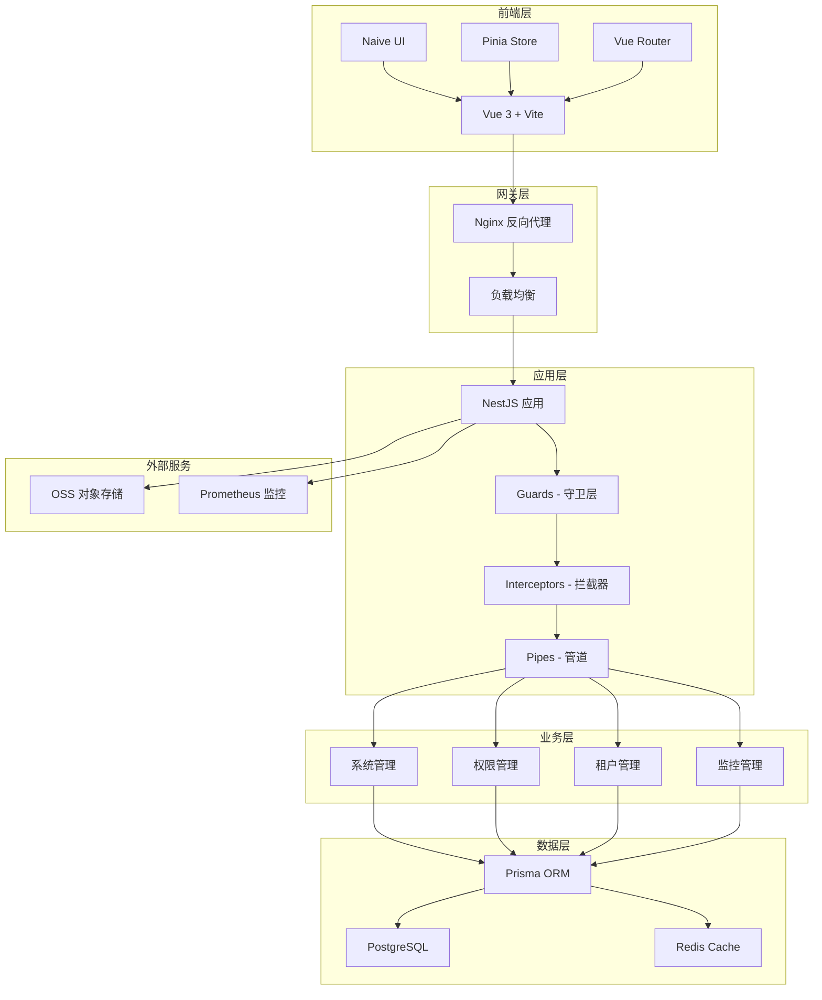
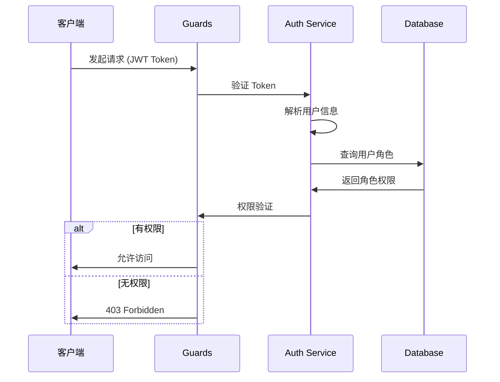

# Nest-Admin-Soybean

<div align="center">

**Language / 语言** 

[English](README_EN.md) | [简体中文](README_CN.md)


[](LICENSE)
[](https://nodejs.org)
[](https://pnpm.io)
[](https://nestjs.com/)
[](https://vuejs.org/)
[](https://vitejs.dev/)
[](https://www.typescriptlang.org/)
[-brightgreen)](server/docs/OPTIMIZATION_README.md)
[](server/docs/OPTIMIZATION_README.md)
[](server/coverage/)

**基于 Vue3 + NestJS 的现代化企业级后台管理系统**

集成强大的权限管理、多租户架构、请求加密、完善的日志监控

[在线演示](https://www.linlingqin.top/) | [快速开始](#快速开始) | [文档](#文档) | [更新日志](CHANGELOG.md) | [🎯 优化报告](server/docs/OPTIMIZATION_README.md)

**🎮 演示账户**
- 账号：`demo` | 密码：`demo123` | 租户：`000000`
- ✅ 拥有所有菜单的查看权限（21个功能模块）
- ❌ 禁止新增、修改、删除等写操作
- 📖 [详细权限说明](docs/TEST_ACCOUNTS.md)

</div>


## ✨ 特性

### 🎯 核心功能
- 🔐 **企业级多租户架构** - 完整的租户隔离、功能开关、配额管理、生命周期管理
- 👥 **RBAC 权限管理** - 基于角色的访问控制，细粒度权限控制
- 🔒 **请求加密** - AES + RSA 混合加密，保护敏感数据传输
- 📊 **系统监控** - Prometheus 指标、健康检查、实时性能监控
- 📝 **操作日志** - 完整的用户操作轨迹记录
- 🎮 **演示模式** - 专为演示站点设计的只读账户系统
- 🌐 **国际化** - 支持中文/英文切换
- 🎨 **主题定制** - 多种主题预设，支持深色模式
- 📱 **响应式设计** - 完美适配各种屏幕尺寸
- 📨 **消息中心** - 短信、邮件、站内信统一管理（🆕 新增）
- 📈 **租户仪表盘** - 租户统计、趋势分析、配额监控（🆕 新增）

### 🛠️ 技术栈

#### 后端技术
- **框架**: NestJS 10.x - 企业级 Node.js 框架
- **ORM**: Prisma 5.x - 类型安全的现代 ORM
- **数据库**: PostgreSQL 14+ - 强大的关系型数据库
- **缓存**: Redis 7+ - 高性能缓存与会话存储
- **认证**: JWT + Passport - 安全的身份验证
- **日志**: Pino + Winston - 高性能结构化日志
- **调度**: @nestjs/schedule + Bull - 定时任务与队列
- **监控**: Prometheus + Terminus - 健康检查与指标采集
- **文档**: Swagger/OpenAPI - 自动生成 API 文档
- **测试**: Jest + fast-check - 单元测试与属性测试

#### 前端技术
- **框架**: Vue 3.5+ - 渐进式 JavaScript 框架
- **构建工具**: Vite 7.x - 新一代前端构建工具
- **UI 框架**: Naive UI 2.43+ - 轻量级 Vue 3 组件库
- **状态管理**: Pinia 3.x - Vue 3 官方状态管理
- **路由**: Vue Router 4 + Elegant Router - 文件路由
- **CSS**: UnoCSS - 原子化 CSS 引擎
- **请求**: Axios - HTTP 客户端
- **类型**: TypeScript 5.x - 类型安全
- **测试**: Vitest + Cypress + fast-check - 单元/E2E/属性测试

---

## 📐 系统架构

### 整体架构图



### 多租户架构

```
┌─────────────────────────────────────────────────────────────┐
│                      HTTP 请求层                             │
│  ┌─────────────────────────────────────────────────────┐   │
│  │           TenantHttpMiddleware                       │   │
│  │  - 从 JWT/Header/Query 提取租户ID                    │   │
│  │  - 初始化 TenantContext (AsyncLocalStorage)          │   │
│  └─────────────────────────────────────────────────────┘   │
└─────────────────────────────────────────────────────────────┘
                              │
                              ▼
┌─────────────────────────────────────────────────────────────┐
│                     数据访问层                               │
│  ┌─────────────────────────────────────────────────────┐   │
│  │           Prisma Tenant Middleware                   │   │
│  │  - 自动注入 tenantId 过滤条件                        │   │
│  │  - 自动设置创建数据的 tenantId                       │   │
│  │  - findUnique 结果验证租户归属                       │   │
│  └─────────────────────────────────────────────────────┘   │
└─────────────────────────────────────────────────────────────┘
```

**核心组件：**
- `TenantContext` - AsyncLocalStorage 实现的租户上下文
- `TenantHttpMiddleware` - HTTP 请求租户识别
- `Prisma Tenant Middleware` - 数据层自动租户过滤
- `TenantLifecycleService` - 租户生命周期管理
- `FeatureToggleService` - 功能开关服务
- `TenantQuotaService` - 配额管理服务
- `RelationValidationService` - 应用层关联验证（无外键）

📖 [详细文档](docs/guide/multi-tenant.md)

### 权限控制流程



---

## 🎨 功能模块

### 1️⃣ 系统管理
- **用户管理** - 用户增删改查、密码重置、角色分配
- **角色管理** - 角色权限配置、数据权限范围
- **菜单管理** - 菜单树管理、路由配置、按钮权限
- **部门管理** - 组织架构树、部门人员管理
- **岗位管理** - 岗位配置、人员岗位关联
- **字典管理** - 系统字典、数据字典维护
- **参数配置** - 系统参数、动态配置管理
- **通知公告** - 系统公告发布与管理
- **操作日志** - 详细的操作轨迹记录
- **登录日志** - 登录历史、登录统计

### 2️⃣ 租户管理
- **租户列表** - 租户信息管理、启用停用
- **租户套餐** - 功能套餐配置、菜单权限分配
- **功能开关** - 租户级别功能启用/禁用控制
- **配额管理** - 用户数、存储空间、API调用量限制
- **租户生命周期** - 创建、初始化、状态变更、禁用
- **数据隔离** - 自动化租户数据隔离（Prisma Middleware）
- **缓存隔离** - 租户级别缓存键隔离
- **🆕 租户仪表盘** - 租户统计概览、趋势图、套餐分布、即将到期列表
- **🆕 租户配额管理** - 配额查询、编辑、使用监控、变更记录
- **🆕 租户审计日志** - 操作追踪、数据对比、筛选导出
- **🆕 租户切换** - 管理员快速切换租户上下文

### 3️⃣ 系统监控
- **在线用户** - 实时在线用户、强制下线
- **定时任务** - Cron 任务配置、执行日志
- **服务监控** - 系统信息、运行状态
- **缓存监控** - Redis 缓存管理
- **健康检查** - 数据库、Redis、磁盘、内存检查
- **性能指标** - Prometheus 指标采集

### 4️⃣ 对象存储
- **文件上传** - 支持本地/云存储（阿里云、七牛云、MinIO）
- **文件管理** - 文件预览、下载、删除
- **OSS 配置** - 多存储配置切换

### 5️⃣ 演示账户
- **演示模式** - 为演示站点设计的只读账户
- **权限限制** - 仅查看权限，无法增删改
- **快速登录** - 登录页面一键填充
- **灵活配置** - 基于 RBAC 可随时调整权限范围

### 6️⃣ 消息管理（🆕 新增）
- **短信管理** - 短信渠道配置（阿里云、腾讯云）、模板管理、发送日志
- **邮件管理** - 邮箱账号配置、邮件模板、发送日志
- **站内信** - 站内信模板、消息发送、已读管理、通知铃铛

### 7️⃣ 代码生成（开发中）
- **表管理** - 数据库表导入
- **代码生成** - 前后端代码一键生成

---

## 📸 系统截图

### 登录页面

> 支持账号密码登录、验证码验证、记住密码

### 首页仪表板

> 系统概览、快捷入口、数据统计

### 用户管理

> 用户列表、角色分配、部门选择、用户状态管理

### 角色管理

> 角色权限配置、菜单权限树、数据权限范围

### 菜单管理

> 菜单树形结构、路由配置、图标选择

### 租户管理

> 多租户列表、套餐配置、租户状态

### 定时任务

> Cron 任务配置、执行日志、任务管理

### 系统监控

> 服务器状态、资源使用、实时监控

### 操作日志

> 操作记录、详细参数、异常捕获

### 主题配置

> 多主题切换、深色模式、布局配置

---

## 🚀 快速开始

### 环境要求

- **Node.js**: >= 20.19.0
- **pnpm**: >= 10.5.0
- **PostgreSQL**: >= 14.0
- **Redis**: >= 7.0

### 1. 克隆项目

```bash
git clone https://github.com/linlingqin77/Nest-Admin-Soybean.git
cd Nest-Admin-Soybean
```

### 2. 后端启动

```bash
# 进入后端目录
cd server

# 安装依赖
pnpm install

# 生成 RSA 密钥对（用于加密）
pnpm generate:keys

# 配置数据库连接
# 编辑 src/config/index.ts 中的数据库配置

# 生成 Prisma 客户端
pnpm prisma:generate

# 初始化数据库并填充种子数据
pnpm prisma:seed

# 启动开发服务器（端口 8080）
pnpm start:dev
```

### 3. 前端启动

```bash
# 进入前端目录
cd admin-naive-ui

# 安装依赖
pnpm install

# 启动开发服务器（端口 9527）
pnpm dev
```

### 4. 访问系统

- **前端地址**: http://localhost:9527
- **后端地址**: http://localhost:8080
- **API 文档**: http://localhost:8080/api/docs
- **健康检查**: http://localhost:8080/api/health
- **监控指标**: http://localhost:8080/api/metrics

**默认账号**:
- **超级管理员**: `admin` / `admin123` - 拥有所有权限
- **演示账户**: `demo` / `demo123` - 仅查看权限 ⭐ 推荐用于演示
- **测试账户**: `test` / `test123` - 部分权限
- **租户 ID**: `000000` (超级管理员租户)

> 💡 **提示**: 演示账户拥有所有21个功能模块的查看权限，但不能进行任何数据修改操作，非常适合用于产品演示和培训。  
> 📖 查看 [完整账户说明](docs/TEST_ACCOUNTS.md)

### 5. 验证演示账户（可选）

验证演示账户权限配置：

```bash
cd server
npx ts-node scripts/verify-demo-permissions.ts
```

演示账户特性：
- ✅ 完整的菜单访问权限（所有目录和页面）
- ✅ 只读操作权限（查询、导出、预览）
- ❌ 禁止所有写操作（新增、修改、删除）
- 🔒 数据隔离保护（受租户机制保护）
- 📊 权限详情：16个查询权限 + 10个导出权限 + 1个预览权限
- 📖 详细说明: [演示账户权限配置](server/docs/DEMO_ACCOUNT_PERMISSIONS.md)

---

## 📂 项目结构

```
Nest-Admin-Soybean/
├── server/                      # 后端项目
│   ├── src/
│   │   ├── config/            # 配置文件
│   │   ├── core/              # 核心功能
│   │   │   ├── decorators/    # 装饰器
│   │   │   ├── filters/       # 异常过滤器
│   │   │   ├── guards/        # 守卫（认证、权限、租户）
│   │   │   ├── interceptors/  # 拦截器（日志、加密、转换）
│   │   │   └── middleware/    # 中间件
│   │   ├── infrastructure/    # 基础设施
│   │   │   ├── cache/         # 缓存服务
│   │   │   ├── prisma/        # Prisma 配置
│   │   │   └── repository/    # 仓储层
│   │   ├── module/            # 业务模块
│   │   │   ├── main/          # 主模块（认证）
│   │   │   ├── system/        # 系统管理
│   │   │   ├── monitor/       # 系统监控
│   │   │   └── upload/        # 文件上传
│   │   ├── observability/     # 可观测性
│   │   ├── resilience/        # 弹性模块
│   │   ├── security/          # 安全模块
│   │   ├── shared/            # 共享模块
│   │   ├── tenant/            # 多租户模块
│   │   └── main.ts            # 入口文件
│   ├── test/                  # 测试文件（统一存放）
│   │   ├── unit/              # 单元测试
│   │   ├── integration/       # 集成测试
│   │   ├── e2e/               # E2E 测试
│   │   ├── fixtures/          # 测试数据工厂
│   │   ├── helpers/           # 测试辅助函数
│   │   └── mocks/             # Mock 实现
│   ├── prisma/
│   │   ├── schema.prisma      # 数据库模型
│   │   └── seed.ts            # 种子数据
│   ├── keys/                  # RSA 密钥
│   ├── scripts/               # 脚本工具
│   │   ├── init-demo.sh       # 演示账户快速设置
│   │   ├── deploy.cjs         # 部署脚本
│   │   └── ecosystem.config.cjs # PM2 配置
│   └── docs/                  # 后端文档
│
├── admin-naive-ui/              # 前端项目
│   ├── src/
│   │   ├── assets/            # 静态资源
│   │   ├── components/        # 组件
│   │   │   ├── common/        # 公共组件
│   │   │   ├── advanced/      # 高级组件
│   │   │   └── custom/        # 自定义组件
│   │   ├── layouts/           # 布局
│   │   ├── locales/           # 国际化
│   │   ├── router/            # 路由
│   │   ├── service/           # API 服务
│   │   ├── store/             # 状态管理
│   │   ├── theme/             # 主题配置
│   │   ├── utils/             # 工具函数
│   │   └── views/             # 页面视图
│   │       ├── _builtin/      # 内置页面（登录、404 等）
│   │       ├── home/          # 首页
│   │       ├── system/        # 系统管理页面
│   │       ├── monitor/       # 监控页面
│   │       └── tool/          # 工具页面
│   ├── test/                  # 测试文件
│   │   ├── unit/              # 单元测试
│   │   ├── components/        # 组件测试
│   │   ├── fixtures/          # 测试数据
│   │   └── mocks/             # Mock 实现
│   ├── cypress/               # Cypress E2E 测试
│   │   ├── e2e/               # E2E 测试用例
│   │   └── support/           # 支持文件
│   ├── packages/              # 内部包
│   │   ├── axios/             # HTTP 请求
│   │   ├── hooks/             # 钩子函数
│   │   ├── materials/         # 组件库
│   │   ├── utils/             # 工具库
│   │   └── uno-preset/        # UnoCSS 预设
│   └── build/                 # 构建配置
│
└── docs/                        # 文档
    ├── guide/                  # 使用指南
    ├── development/            # 开发文档
    └── deploy-online/          # 部署文档
```

---

## 🔧 核心配置

### 后端配置

**数据库配置** (`server/src/config/index.ts`):
```typescript
db: {
  postgresql: {
    host: 'localhost',
    port: 5432,
    username: 'postgres',
    password: 'your_password',
    database: 'nest_admin'
  }
}
```

**Redis 配置**:
```typescript
redis: {
  host: 'localhost',
  port: 6379,
  password: '123456',
  db: 2
}
```

**JWT 配置**:
```typescript
jwt: {
  secret: 'your-secret-key',
  expiresIn: 7200  // 2小时
}
```

### 前端配置

**环境变量** (`.env.development`):
```bash
# API 地址
VITE_SERVICE_BASE_URL=http://localhost:8080

# 请求超时
VITE_SERVICE_TIMEOUT=60000

# 水印
VITE_WATERMARK=N
```

---

## 🎯 开发指南

### 添加新模块

#### 1. 后端模块

```bash
# 使用 NestJS CLI 生成模块
cd server
nest g module module/admin/newfeature
nest g controller module/admin/newfeature
nest g service module/admin/newfeature
```

#### 2. 前端页面

```bash
# 在 src/views/ 下创建新页面
cd admin-naive-ui/src/views
mkdir newfeature
touch newfeature/index.vue

# 重新生成路由
pnpm gen-route
```

### 多租户开发

使用 `@IgnoreTenant()` 装饰器跳过租户过滤:

```typescript
@IgnoreTenant()
@Get()
async findAll() {
  // 此查询将返回所有租户的数据
  return this.service.findAll();
}
```

### 核心装饰器（🆕 新增）

```typescript
// 幂等性控制 - 防止重复提交
@Idempotent({ timeout: 5000, message: '请勿重复提交' })
@Post()
async create(@Body() dto: CreateDto) {
  return this.service.create(dto);
}

// 分布式锁 - 防止并发冲突
@Lock({ key: 'order:${orderId}', timeout: 10000 })
@Put(':orderId')
async update(@Param('orderId') orderId: string) {
  return this.service.update(orderId);
}

// 数据权限 - 自动过滤数据范围
@DataPermission({ deptAlias: 'd', userAlias: 'u' })
@Get()
async findAll() {
  return this.service.findAll();
}

// 租户定时任务 - 遍历所有租户执行
@TenantJob()
@Cron('0 0 * * *')
async dailyTask() {
  // 自动为每个租户执行
}
```

### 权限控制

使用装饰器控制权限:

```typescript
@RequirePermission('system:user:add')
@Post()
async create(@Body() dto: CreateUserDto) {
  return this.service.create(dto);
}
```

### 请求加密

前端使用 AES + RSA 加密敏感请求:

```typescript
// 自动加密
const response = await request({
  url: '/login',
  method: 'POST',
  data: { username, password },
  headers: { 'x-encrypted': 'true' }
});
```

后端使用 `@SkipDecrypt()` 跳过解密:

```typescript
@SkipDecrypt()
@Post('public-data')
async getPublicData() {
  return { data: 'public' };
}
```

---

## 📊 性能优化

### 已实施的优化

- ✅ **Prisma 连接池** - 优化数据库连接
- ✅ **Redis 缓存** - 热点数据缓存
- ✅ **路由懒加载** - 前端按需加载
- ✅ **组件异步加载** - 减少首屏加载
- ✅ **Gzip 压缩** - 减少传输体积
- ✅ **请求防抖节流** - 优化用户交互
- ✅ **虚拟滚动** - 大列表性能优化

### 性能指标

| 指标 | 目标值 | 当前值 |
|-----|-------|--------|
| 首屏加载 | < 2s | ~1.5s |
| API 响应 | < 200ms | ~150ms |
| 内存占用 | < 300MB | ~250MB |
| 数据库连接 | < 20 | ~10 |

---

## 🔒 安全特性

- ✅ **JWT 认证** - 无状态身份验证
- ✅ **请求加密** - AES-256-CBC + RSA-2048
- ✅ **密码加密** - BCrypt 加密存储
- ✅ **SQL 注入防护** - Prisma 参数化查询
- ✅ **XSS 防护** - 输入过滤与转义
- ✅ **CSRF 防护** - Token 验证
- ✅ **敏感数据脱敏** - 日志自动脱敏
- ✅ **租户隔离** - 数据完全隔离
- ✅ **操作审计** - 完整操作日志

---

## 📝 命令速查

### 后端命令

```bash
# 开发
pnpm start:dev              # 启动开发服务器
pnpm start:prod             # 启动生产服务器

# 数据库
pnpm prisma:generate        # 生成 Prisma 客户端
pnpm prisma:migrate         # 创建并应用迁移
pnpm prisma:seed            # 重置数据库并填充种子数据
pnpm prisma:reset           # 重置迁移

# 构建
pnpm build:dev              # 开发构建
pnpm build:prod             # 生产构建

# 测试
pnpm test                   # 运行单元测试
pnpm test:watch             # 监听模式运行测试
pnpm test:cov               # 运行测试并生成覆盖率报告
pnpm test:e2e               # 运行 E2E 测试
pnpm test:integration       # 运行集成测试
pnpm test:all               # 运行所有测试

# 演示账户
./scripts/init-demo.sh      # 初始化演示账户
pnpm exec ts-node scripts/init-demo-account.ts  # 直接执行初始化脚本

# 工具
pnpm generate:keys          # 生成 RSA 密钥对
pnpm redis:flush            # 清空 Redis
pnpm logs:view              # 查看日志
pnpm logs:error             # 查看错误日志
```

### 前端命令

```bash
# 开发
pnpm dev                    # 启动开发服务器
pnpm preview               # 预览生产构建

# 构建
pnpm build                 # 生产构建
pnpm build:dev             # 开发构建
pnpm build:test            # 测试构建

# 代码质量
pnpm lint                  # ESLint 检查
pnpm typecheck             # TypeScript 类型检查
pnpm format                # 代码格式化

# 测试
pnpm test                  # 运行单元测试
pnpm test:watch            # 监听模式运行测试
pnpm test:cov              # 运行测试并生成覆盖率报告
pnpm test:ui               # 可视化测试界面
pnpm cypress:open          # 打开 Cypress 交互界面
pnpm cypress:run           # 运行 Cypress E2E 测试
pnpm test:all              # 运行所有测试

# 工具
pnpm gen-route             # 生成路由
pnpm gen:api               # 生成 API 类型
pnpm cleanup               # 清理依赖
```

---

## 🗺️ 未来发展方向

### 短期计划（1-3个月）

- [x] **消息中心** - 站内消息、邮件、短信通知 ✅ 已完成
- [x] **租户增强** - 仪表盘、配额管理、审计日志 ✅ 已完成
- [ ] **移动端适配** - 开发移动端 H5 版本
- [ ] **微服务拆分** - 将单体应用拆分为微服务架构
- [ ] **Docker 部署** - 提供完整的 Docker Compose 方案
- [ ] **代码生成优化** - 完善代码生成器功能
- [ ] **工作流引擎** - 集成审批流程引擎
- [ ] **数据大屏** - 可视化数据展示

### 中期计划（3-6个月）

- [ ] **多数据库支持** - 支持 MySQL、MongoDB
- [ ] **国际化增强** - 支持更多语言
- [ ] **插件系统** - 可插拔的插件架构
- [ ] **AI 助手** - 集成 AI 辅助开发
- [ ] **低代码平台** - 可视化配置页面
- [ ] **报表系统** - 自定义报表生成
- [ ] **移动端 App** - 原生移动应用

### 长期计划（6-12个月）

- [ ] **Cloud Native** - 云原生架构改造
- [ ] **Serverless** - 支持 Serverless 部署
- [ ] **边缘计算** - 边缘节点支持
- [ ] **区块链集成** - 数据可信存证
- [ ] **大数据分析** - 集成数据分析平台
- [ ] **智能运维** - AIOps 智能运维
- [ ] **跨平台桌面端** - Electron 桌面应用

---

## 🤝 参与贡献

我们非常欢迎您的贡献！请遵循以下步骤：

1. Fork 本仓库
2. 创建特性分支 (`git checkout -b feature/AmazingFeature`)
3. 提交更改 (`git commit -m 'Add some AmazingFeature'`)
4. 推送到分支 (`git push origin feature/AmazingFeature`)
5. 开启 Pull Request

### 代码规范

- 遵循 ESLint 配置
- 使用 TypeScript 类型注解
- 编写清晰的注释
- 提交前运行测试

---

## 📄 开源协议

本项目基于 [MIT](LICENSE) 协议开源。

---

## 🙏 鸣谢

感谢以下开源项目：

- [NestJS](https://nestjs.com/) - 渐进式 Node.js 框架
- [Vue.js](https://vuejs.org/) - 渐进式 JavaScript 框架
- [Naive UI](https://www.naiveui.com/) - Vue 3 组件库
- [Prisma](https://www.prisma.io/) - 现代 ORM
- [Vite](https://vitejs.dev/) - 新一代前端构建工具
- [UnoCSS](https://unocss.dev/) - 原子化 CSS 引擎
- [Soybean Admin](https://github.com/soybeanjs/soybean-admin) - 优秀的管理系统模板

---

## 📞 联系方式

- **作者**: linlingqin77
- **邮箱**: linlingqin77@qq.com
- **GitHub**: [@linlingqin77](https://github.com/linlingqin77)
- **项目地址**: [https://github.com/linlingqin77/Nest-Admin-Soybean](https://github.com/linlingqin77/Nest-Admin-Soybean)

---

## ⭐ Star History

如果这个项目对您有帮助，请给个 Star ⭐️

[](https://star-history.com/#linlingqin77/Nest-Admin-Soybean&Date)

---

<div align="center">

**让开发更简单，让管理更高效**

Made with ❤️ by [linlingqin77](https://github.com/linlingqin77)

</div>
